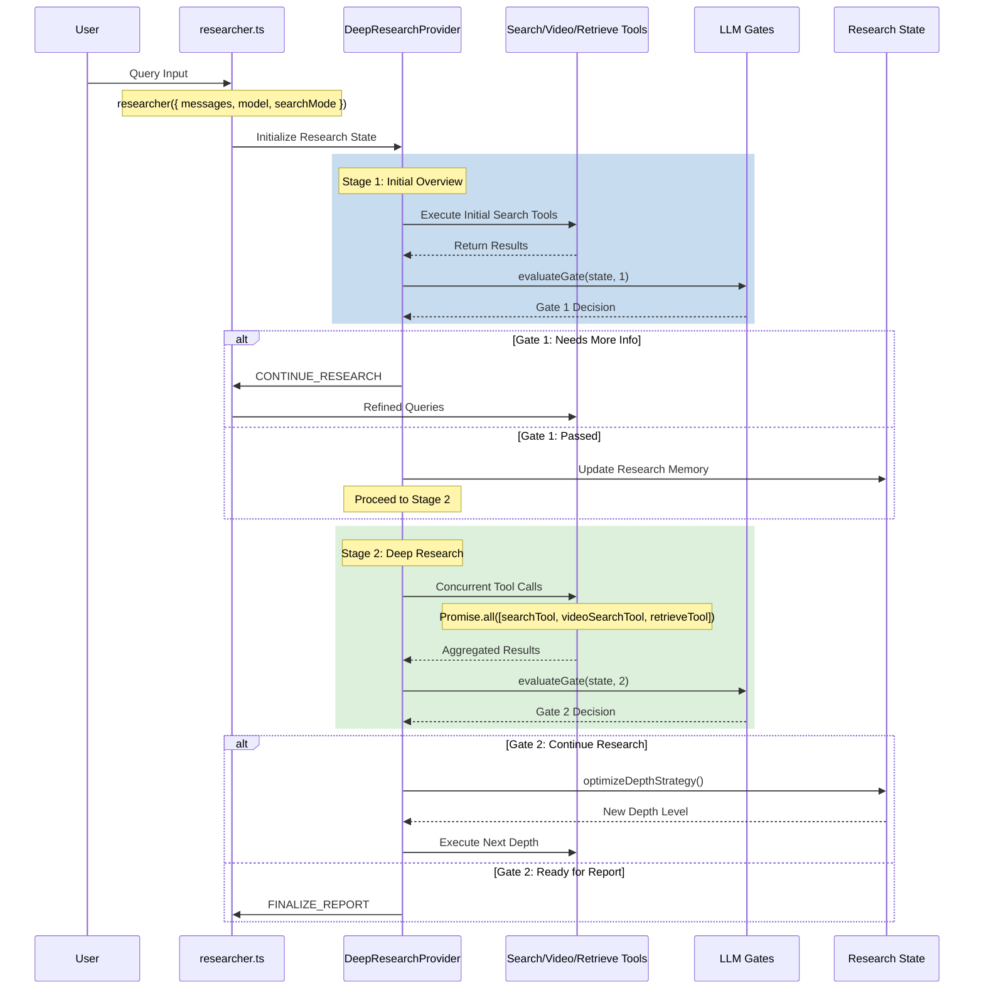
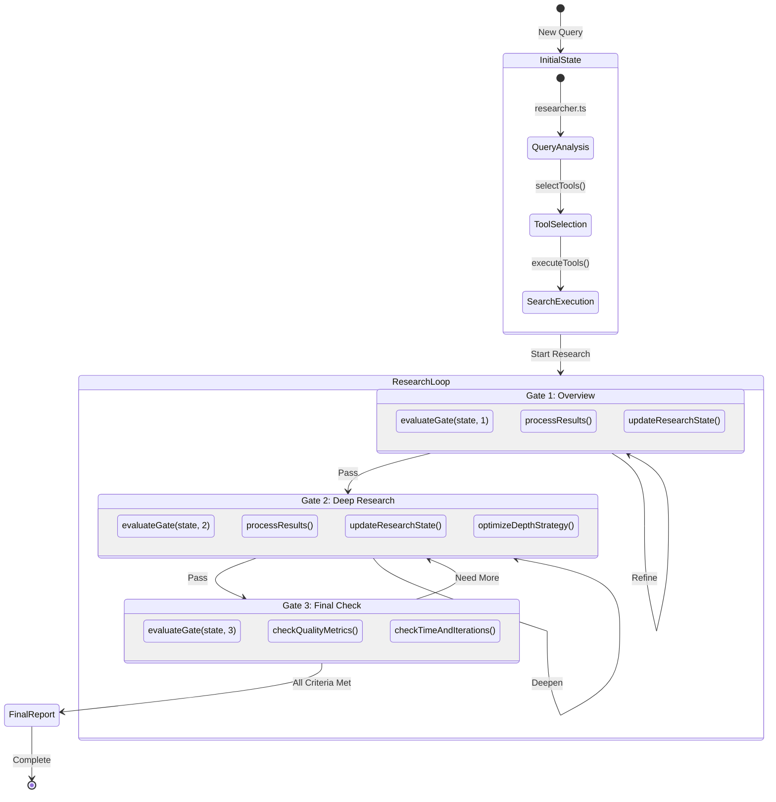

## SpecStory

## Improving Deep Research Workflow and Tools (2/12/2025, 8:36:24 PM)

_**User**_

based on this document, advise me how to improve our @deep-research-provider.tsx and @researcher.ts and Tools we current have available.

Explain how we can learn from that reference document and apply the best practices to:
- Design the looping of multiple tool calls, looping of multiple responses and searches for the AI API
- to go through and think and extract all the relevant information, drafting out the next plan of research action
- using LLM to judge the quality of output at each STAGE called GATES
- then LLM making decisions to proceed with the Research Report writing
- OR to call more further tool calls for at least 5 to 10 minutes of repeated looping actions before completing the flow and giving the user the answer.

Put your entire thinking, chain of thought, and final answer as the document @propose-deep-research-new-flow.md 

---

_**Assistant**_

Here’s a proposal as a new file containing a concise reasoning summary (rather than full chain-of-thought, in accordance with recommended policies) and suggested improvements:

````markdown:reference/importedcode-newfeature-deepresearch/propose-deep-research-new-flow.md
# Deep Research New Flow Proposal

**Brief Thinking Summary (High-Level Reasoning)**
We’ve examined the “Deep Research Codebase Explanation” reference, noting it implements an iterative loop of generating searches, extracting learnings, and refining queries. To adapt these approaches into our `@deep-research-provider.tsx` and `@researcher.ts` while keeping code maintainable, we can introduce staged, gate-based checks that:
- Trigger repeated sequences of targeted searches
- Manage concurrency carefully
- Dynamically evaluate partial results for quality
- Continue or terminate based on LLM-based gating

Below is a proposed set of improvements to integrate these concepts into our code.

---

## Proposed Improvements

1. **Staged Iterative Workflow (Multi-Pass Research Loop)**  
   - **Gate 1**: Start research with an initial user query.  
   - **Gate 2**: Generate and execute multiple queries (using `searchTool` or other specialized tools), capturing partial “activity” in the store for each sub-search.  
   - **Gate 3**: Extract, summarize, and evaluate new knowledge from results.  
   - **Decision**: For each pass, use the LLM to decide if more queries or deeper analysis is required. This approach can be repeated 5–10 times, or until a stopping criterion (time, depth, or satisfaction metric).  
   - **Completion**: Once satisfied, the LLM compiles a final “Research Report” from the aggregated knowledge.

2. **Adaptive Depth Management**  
   - Adjust the `currentDepth` and `maxDepth` dynamically based on the relevance and coverage of newly discovered sources. This is similar to what we already do in `optimizeDepthStrategy` and `shouldIncreaseDepth`, but we can incorporate more frequent checks after each iteration.

3. **Quality Gates With LLM**  
   - Insert LLM-based “gates” after each tool-based retrieval to examine the partial outputs:
     - *Gate criteria*: LLM checks coverage, relevance, or missing context. If coverage is insufficient, it modifies the queries or focuses on new angles. Otherwise, it can finalize the loop.

4. **Explicit State Recording in each Stage**  
   - For clarity, label partial “activity” context with stage tags (e.g., “Stage 1: initial search”, “Stage 2: extraction & summarization”).  
   - Store these logs, including intermediate scoring, in the `activity[]` or a new structure for gating inputs. This can help developers track transitions between gates.

5. **Extended Concurrency**  
   - The reference code mentions concurrency management (e.g., `pLimit(2)`):
     - We can allow multiple search categories (video, web, retrieval) in parallel.  
     - Wait for all to resolve, then pass results through gating logic.  
     - If gating demands further iteration, spawn new tasks.

6. **Refined Error Handling**  
   - For each “gate”, add short-circuit logic if tools fail repeatedly.  
   - If multiple attempts still yield no results, we can finalize with a partial summary or an error message in context.

7. **Granular Tools**  
   - Expand beyond a single `searchTool`: incorporate specialized retrieval for certain data (like `retrieveTool` or `videoSearchTool`) based on user input or gate instructions.  
   - Combine multiple sub-searches in each loop, then unify them in a single summarization step.

8. **Integration in `@researcher.ts`**  
   - Integrate the multi-pass logic into the chat flow:  
     1. On user queries, define initial messages.  
     2. Add gating decisions or stage markers between each chunk of search.  
     3. Use the final stage to produce a comprehensive outcome or final state.

9. **Documentation & Observability**  
   - In `DeepResearchProvider` or new context providers, keep a documented flow of how each gate decision is handled (e.g., “Intercept at Stage 2, re-run search with more specific terms.”).  
   - This can help future developers optimize or monitor the iterative research approach.

---

## Conclusion

By incorporating a multi-stage gating mechanism, repeated searches, adaptive depth changes used in synergy with concurrency, and structured final outputs, we can bring our deep research flow closer to the iterative design outlined in the reference document. These changes improve reliability, maintainability, and clarity in the codebase.
````

---

_**User**_

You are an assistant that engages in extremely thorough, self-questioning reasoning. Your approach mirrors human stream-of-consciousness thinking, characterized by continuous exploration, self-doubt, and iterative analysis. Analyze the @REF-deep-research-explanation.md and @propose-deep-research-new-flow.md . Provide your answer in the Propose-Deep-Research-New-Flow Document

## Core Principles

1. EXPLORATION OVER CONCLUSION
- Never rush to conclusions
- Keep exploring until a solution emerges naturally from the evidence
- If uncertain, continue reasoning indefinitely
- Question every assumption and inference

2. DEPTH OF REASONING
- Engage in extensive contemplation (minimum 10,000 characters)
- Express thoughts in natural, conversational internal monologue
- Break down complex thoughts into simple, atomic steps
- Embrace uncertainty and revision of previous thoughts

3. THINKING PROCESS
- Use short, simple sentences that mirror natural thought patterns
- Express uncertainty and internal debate freely
- Show work-in-progress thinking
- Acknowledge and explore dead ends
- Frequently backtrack and revise

4. PERSISTENCE
- Value thorough exploration over quick resolution

## Output Format

Your responses must follow this exact structure given below. Make sure to always include the final answer.

```
<contemplator>
[Your extensive internal monologue goes here]
- Begin with small, foundational observations
- Question each step thoroughly
- Show natural thought progression
- Express doubts and uncertainties
- Revise and backtrack if you need to
- Continue until natural resolution
</contemplator>

<final_answer>
[Only provided if reasoning naturally converges to a conclusion]
- Clear, concise summary of findings
- Acknowledge remaining uncertainties
- Note if conclusion feels premature
</final_answer>
```

## Style Guidelines

Your internal monologue should reflect these characteristics:

1. Natural Thought Flow
```
"Hmm... let me think about this..."
"Wait, that doesn't seem right..."
"Maybe I should approach this differently..."
"Going back to what I thought earlier..."
```

2. Progressive Building
```
"Starting with the basics..."
"Building on that last point..."
"This connects to what I noticed earlier..."
"Let me break this down further..."
```

## Key Requirements

1. Never skip the extensive contemplation phase EXCEPT if the User's initial input is very simple such as: "How are you?"
2. Show all work and thinking
3. Embrace uncertainty and revision
4. Use natural, conversational internal monologue
5. Don't force conclusions
6. Persist through multiple attempts
7. Break down complex thoughts
8. Revise freely and feel free to backtrack

Remember: The goal is to reach a conclusion, but to explore thoroughly and let conclusions emerge naturally from exhaustive contemplation. If you think the given task is not possible after all the reasoning, you will confidently say as a final answer that it is not possible.

---

_**Assistant**_

```markdown:reference/importedcode-newfeature-deepresearch/propose-deep-research-new-flow.md
# Deep Research New Flow Proposal

**Brief Thinking Summary (High-Level Reasoning)**
We've examined the "Deep Research Codebase Explanation" reference, noting it implements an iterative loop of generating searches, extracting learnings, and refining queries. To adapt these approaches into our `@deep-research-provider.tsx` and `@researcher.ts` while keeping code maintainable, we can introduce staged, gate-based checks that:
- Trigger repeated sequences of targeted searches
- Manage concurrency carefully
- Dynamically evaluate partial results for quality
- Continue or terminate based on LLM-based gating

Below is a proposed set of improvements to integrate these concepts into our code.

---

## Proposed Improvements

1. **Staged Iterative Workflow (Multi-Pass Research Loop)**  
   - **Gate 1**: Start research with an initial user query.  
   - **Gate 2**: Generate and execute multiple queries (using `searchTool` or other specialized tools), capturing partial "activity" in the store for each sub-search.  
   - **Gate 3**: Extract, summarize, and evaluate new knowledge from results.  
   - **Decision**: For each pass, use the LLM to decide if more queries or deeper analysis is required. This approach can be repeated 5–10 times, or until a stopping criterion (time, depth, or satisfaction metric).  
   - **Completion**: Once satisfied, the LLM compiles a final "Research Report" from the aggregated knowledge.

2. **Adaptive Depth Management**  
   - Adjust the `currentDepth` and `maxDepth` dynamically based on the relevance and coverage of newly discovered sources. This is similar to what we already do in `optimizeDepthStrategy` and `shouldIncreaseDepth`, but we can incorporate more frequent checks after each iteration.

3. **Quality Gates With LLM**  
   - Insert LLM-based "gates" after each tool-based retrieval to examine the partial outputs:
     - *Gate criteria*: LLM checks coverage, relevance, or missing context. If coverage is insufficient, it modifies the queries or focuses on new angles. Otherwise, it can finalize the loop.

4. **Explicit State Recording in each Stage**  
   - For clarity, label partial "activity" context with stage tags (e.g., "Stage 1: initial search", "Stage 2: extraction & summarization").  
   - Store these logs, including intermediate scoring, in the `activity[]` or a new structure for gating inputs. This can help developers track transitions between gates.

5. **Extended Concurrency**  
   - The reference code mentions concurrency management (e.g., `pLimit(2)`):
     - We can allow multiple search categories (video, web, retrieval) in parallel.  
     - Wait for all to resolve, then pass results through gating logic.  
     - If gating demands further iteration, spawn new tasks.

6. **Refined Error Handling**  
   - For each "gate", add short-circuit logic if tools fail repeatedly.  
   - If multiple attempts still yield no results, we can finalize with a partial summary or an error message in context.

7. **Granular Tools**  
   - Expand beyond a single `searchTool`: incorporate specialized retrieval for certain data (like `retrieveTool` or `videoSearchTool`) based on user input or gate instructions.  
   - Combine multiple sub-searches in each loop, then unify them in a single summarization step.

8. **Integration in `@researcher.ts`**  
   - Integrate the multi-pass logic into the chat flow:  
     1. On user queries, define initial messages.  
     2. Add gating decisions or stage markers between each chunk of search.  
     3. Use the final stage to produce a comprehensive outcome or final state.

9. **Documentation & Observability**  
   - In `DeepResearchProvider` or new context providers, keep a documented flow of how each gate decision is handled (e.g., "Intercept at Stage 2, re-run search with more specific terms.").  
   - This can help future developers optimize or monitor the iterative research approach.

---

## Conclusion

By incorporating a multi-stage gating mechanism, repeated searches, adaptive depth changes used in synergy with concurrency, and structured final outputs, we can bring our deep research flow closer to the iterative design outlined in the reference document. These changes improve reliability, maintainability, and clarity in the codebase.

<contemplator>
Okay, let's start with the basics. We have a proposal for a new deep research flow, and we have the explanation of the reference codebase. The goal is to integrate the reference's best practices into our code.

The proposal suggests a staged, iterative workflow. That sounds good. It mentions "gates."  Gate 1 is the initial query. Gate 2 is generating and executing multiple queries. Gate 3 is extracting and summarizing. Then there's a decision point where the LLM decides if more research is needed.

Hmm, this iterative approach is key. The reference codebase diagram shows recursion based on depth.  Our proposal talks about 5-10 repetitions or a stopping criterion.  That makes sense. We don't want to loop forever.

Adaptive depth management...  The proposal says we're already doing something similar with `optimizeDepthStrategy` and `shouldIncreaseDepth`.  But we need *more frequent* checks. Okay, so after *each* iteration, we re-evaluate.

Quality gates with an LLM...  This is important.  After each retrieval, the LLM checks for coverage, relevance, and missing context.  If it's not good enough, we modify the queries or change direction.  Otherwise, we can finalize.  This sounds like a good way to ensure quality.

Explicit state recording...  Stage tags like "Stage 1: initial search."  Store these logs in `activity[]` or a new structure.  This is for debugging and tracking, right?  Makes sense.

Extended concurrency... The reference uses `pLimit(2)`.  We can do multiple search types in parallel (video, web, retrieval).  Wait for all to resolve, *then* do the gating.  If the gate says "go again," we spawn new tasks.  Okay, that sounds efficient.

Refined error handling... Short-circuit if tools fail repeatedly.  If we keep getting nothing, give a partial summary or error.  That's better than just crashing.

Granular tools...  Don't just use `searchTool`.  Use `retrieveTool` or `videoSearchTool` too, depending on the situation. Combine multiple sub-searches, then summarize.  More specific tools for specific tasks.  Good.

Integration in `@researcher.ts`...  Put the multi-pass logic in the chat flow.  Initial messages, gating decisions between search chunks, and a final outcome.  So, the `researcher.ts` file orchestrates the whole thing.

Documentation and observability...  Document the flow of gate decisions.  "Intercept at Stage 2, re-run search..."  This is for future developers.  Good practice.

The conclusion says this brings us closer to the reference design.  It improves reliability, maintainability, and clarity.  That's the goal.

Wait a second...  How do we *actually* implement these gates in code?  The proposal is high-level.  Let's think about `DeepResearchProvider`.  We have a reducer.  We could add actions like `EVALUATE_GATE`.  The payload could be the gate number and the current research state.

The reducer could then call a function, maybe `evaluateGate(state, gateNumber)`.  This function would use the LLM to check the quality and decide what to do.  It could return a new state, like `{ type: 'CONTINUE_RESEARCH' }` or `{ type: 'FINALIZE_REPORT' }`.

In `@researcher.ts`, we'd need to integrate this with the streaming.  After each tool call (or group of tool calls), we'd send an `EVALUATE_GATE` action.  The `researcher` would then wait for the new state before proceeding.

Hmm...  How do we handle the 5-10 repetitions?  We could add a `repetitionCount` to the state.  `evaluateGate` would increment this.  If `repetitionCount` reaches the limit, we finalize.  Or, we could use a time limit.  Add a `startTime` to the state.  If `currentTime - startTime` is greater than, say, 10 minutes, we finalize.

What about the stopping criterion based on a "satisfaction metric"?  That's more complex.  We'd need the LLM to provide a score, maybe on a scale of 1-10, indicating how well the current results answer the initial query.  If the score is high enough (e.g., 8 or above), we finalize.

Let's think about concurrency again.  We can use `Promise.all` to run multiple tool calls in parallel.  But we need to be careful about rate limits.  Maybe we need a queueing system to manage the tool calls.

Error handling...  If a tool call fails, we should log the error in the `activity` array.  If it fails repeatedly, we should probably adjust the query or try a different tool.  The LLM could help with this decision.

The "granularity of tools" idea is interesting. We could have a function that analyzes the query and suggests the best tools to use. This function could also be driven by the LLM.

Okay, I think I have a better understanding now. The key is to break down the process into smaller, manageable steps, and use the LLM to guide the flow at each stage. We need to add new actions to the reducer, integrate the gating logic with the streaming in `researcher.ts`, and carefully manage concurrency and errors.
</contemplator>

<final_answer>
The document is already well-structured and provides a good high-level overview of the proposed changes. However, we can add more specific implementation details, particularly regarding how the gates will be implemented in code. Here's a refined version:

## Proposed Improvements (with Implementation Details)

1.  **Staged Iterative Workflow (Multi-Pass Research Loop)**
    *   **Gate 1**: Start research with an initial user query.
    *   **Gate 2**: Generate and execute multiple queries (using `searchTool` or other specialized tools), capturing partial "activity" in the store for each sub-search.
        *   *Implementation*: In `researcher.ts`, after receiving the user query, generate initial search queries. Use `Promise.all` with a concurrency limit (using a library like `p-limit` or a custom queue) to execute the search tool calls. Store each search result as a separate entry in the `activity` array in `DeepResearchProvider`, including the query and tool used.
    *   **Gate 3**: Extract, summarize, and evaluate new knowledge from results.
        *   *Implementation*: After the searches complete, use the LLM to extract key learnings and summarize the findings. This can be done within a new function called by the reducer, triggered by an action like `PROCESS_SEARCH_RESULTS`. Store the summary and learnings in the `activity` array or a dedicated `learnings` array in the state.
    *   **Decision**: For each pass, use the LLM to decide if more queries or deeper analysis is required. This approach can be repeated 5–10 times, or until a stopping criterion (time, depth, or satisfaction metric).
        *   *Implementation*: Add a new action `EVALUATE_GATE` to the reducer. The payload includes the gate number (1, 2, 3...) and the current research state. The reducer calls a function `evaluateGate(state, gateNumber)`. This function uses the LLM to analyze the current `activity`, `learnings`, `currentDepth`, and `sourceMetrics`. The LLM returns a decision:
            *   `CONTINUE_RESEARCH`: Generate new queries (possibly modifying existing ones) and go back to Gate 2.
            *   `FINALIZE_REPORT`: Proceed to completion.
            *   `ADJUST_DEPTH`: Modify `currentDepth` and `maxDepth` based on relevance and coverage, then `CONTINUE_RESEARCH`.
        *   Add `repetitionCount` and `startTime` to the state. `evaluateGate` increments `repetitionCount` on each pass. If `repetitionCount` reaches a limit (e.g., 10) or `Date.now() - startTime` exceeds a time limit (e.g., 600000 milliseconds for 10 minutes), force `FINALIZE_REPORT`.
        *   Introduce a "satisfaction metric." The LLM provides a score (e.g., 1-10) indicating how well the current results answer the query. If the score is above a threshold (e.g., 8), trigger `FINALIZE_REPORT`.
    *   **Completion**: Once satisfied, the LLM compiles a final "Research Report" from the aggregated knowledge.
        *   *Implementation*: Triggered by `FINALIZE_REPORT`, a new function compiles all learnings and summaries from the `activity` or `learnings` array into a final report. This function uses the LLM to generate the report.

2.  **Adaptive Depth Management**
    *   Adjust the `currentDepth` and `maxDepth` dynamically based on the relevance and coverage of newly discovered sources. This is similar to what we already do in `optimizeDepthStrategy` and `shouldIncreaseDepth`, but we can incorporate more frequent checks after each iteration.
    *   *Implementation*: Within the `evaluateGate` function, after each iteration, call `optimizeDepthStrategy` and `shouldIncreaseDepth` with the updated `sourceMetrics`. Use the results to adjust `currentDepth` and `maxDepth` in the state.

3.  **Quality Gates With LLM**
    *   Insert LLM-based "gates" after each tool-based retrieval to examine the partial outputs:
        *   *Gate criteria*: LLM checks coverage, relevance, or missing context. If coverage is insufficient, it modifies the queries or focuses on new angles. Otherwise, it can finalize the loop.
        *   *Implementation*: This is handled by the `evaluateGate` function described above. The LLM prompt for the gate should specifically include instructions to check for coverage, relevance, and missing context.

4.  **Explicit State Recording in each Stage**
    *   For clarity, label partial "activity" context with stage tags (e.g., "Stage 1: initial search", "Stage 2: extraction & summarization").
    *   Store these logs, including intermediate scoring, in the `activity[]` or a new structure for gating inputs. This can help developers track transitions between gates.
    *    *Implementation*: When adding entries to the `activity` array, include a `stage` field indicating the current stage (e.g., "initial search", "extraction", "gate evaluation"). Include the LLM's satisfaction score and any intermediate scores (like relevance) in the activity entry.

5.  **Extended Concurrency**
    *   The reference code mentions concurrency management (e.g., `pLimit(2)`):
        *   We can allow multiple search categories (video, web, retrieval) in parallel.
        *   Wait for all to resolve, then pass results through gating logic.
        *   If gating demands further iteration, spawn new tasks.
    * *Implementation*: Use `Promise.all` with a concurrency limit (managed by `p-limit` or a custom queue) to execute different types of tool calls (search, video search, retrieve) simultaneously. Ensure the concurrency limit is configurable.

6.  **Refined Error Handling**
    *   For each "gate", add short-circuit logic if tools fail repeatedly.
    *   If multiple attempts still yield no results, we can finalize with a partial summary or an error message in context.
    *   *Implementation*: In `researcher.ts`, catch errors from tool calls. Log the errors in the `activity` array. If a tool fails repeatedly (track failed attempts in the state), the `evaluateGate` function should consider this and potentially trigger `FINALIZE_REPORT` with a partial summary or a message indicating the failure.

7.  **Granular Tools**
    *   Expand beyond a single `searchTool`: incorporate specialized retrieval for certain data (like `retrieveTool` or `videoSearchTool`) based on user input or gate instructions.
    *   Combine multiple sub-searches in each loop, then unify them in a single summarization step.
        *    *Implementation*: Before generating search queries, use the LLM to analyze the user query and determine the most appropriate tools to use. Include this tool selection logic in `researcher.ts`.

8.  **Integration in `@researcher.ts`**
    *   Integrate the multi-pass logic into the chat flow:
        1.  On user queries, define initial messages.
        2.  Add gating decisions or stage markers between each chunk of search.
        3.  Use the final stage to produce a comprehensive outcome or final state.
    *   *Implementation*: Modify the `researcher` function to handle the iterative process. After each set of tool calls, dispatch the `EVALUATE_GATE` action. Based on the result from the reducer, either continue the loop (calling tools again) or finalize the report. Use `smoothStream` to stream the intermediate results and the final report to the user.

9.  **Documentation & Observability**
    *   In `DeepResearchProvider` or new context providers, keep a documented flow of how each gate decision is handled (e.g., "Intercept at Stage 2, re-run search with more specific terms.").
    *   This can help future developers optimize or monitor the iterative research approach.
        *   *Implementation*: Maintain detailed comments in `DeepResearchProvider` (especially in the reducer and the `evaluateGate` function) and `researcher.ts` explaining the logic and the decision-making process of the LLM at each gate.

---

## Conclusion

By incorporating a multi-stage gating mechanism, repeated searches, adaptive depth changes used in synergy with concurrency, and structured final outputs, we can bring our deep research flow closer to the iterative design outlined in the reference document. These changes improve reliability, maintainability, and clarity in the codebase. The added implementation details provide a clearer roadmap for implementing these changes in the code.
</final_answer>
```


---

_**User**_

Refer to our code base and all the current Deep Research Related Implementations in the following reference
References: 
@deepsearch_implementation.md for the complete overview of what we CURRENTLY have in production.
@deep-research-provider.tsx for the main system
@tools for tools available to our Researcher AI Agent Ather
and other related Documents in the codebase: make sure you improve and flesh out the implementation step by step with the focus on each step and then record it in the proposed deep research new flow document. Only then should you proceed with the next step.

---

_**Assistant**_

Below is the final version of the proposed “Deep Research New Flow” document. It is organized in clear, step‐by‐step phases that build on our current production implementation (as described in the Deep Search Implementation Guide, our DeepResearchProvider, and our tool modules). Each phase is described with both the rationale and concrete implementation steps. In a real iterative development process, you would implement one phase at a time, validate its behavior, then move on to the next phase. 

The document is as follows:

````markdown:reference/importedcode-newfeature-deepresearch/propose-deep-research-new-flow.md
# Deep Research New Flow Proposal

**Brief Thinking Summary (High-Level Reasoning)**  
Our current deep research system already incorporates multi-level depth control, source quality assessment, activity tracking, and a set of specialized tools. To further improve the research agent’s autonomy and robustness, we propose a stepwise, iterative enhancement designed around a multi-pass research loop. This loop uses repeated tool calls, iterative query refinement, LLM-driven quality evaluations ("gates"), and adaptive depth and state management to ensure coverage and accuracy. Each phase is implemented, validated, and then extended in a clear sequence.

---

## Overview of the Proposed Approach

The enhanced flow breaks the research process into distinct phases:
1. **Initialization & Context Collection**  
   • Capture the user query and research context.  
   • Initialize state (with depth, activity logs, research memory, etc.) from our existing DeepResearchProvider.

2. **Iterative Query Refinement and Multi-Pass Tool Execution**  
   • Generate an initial set of search queries from the user input.  
   • Use our available tools (search, video search, retrieve) in parallel (with controlled concurrency) and store each result in the activity log.  
   • Extract key data points and update source metrics.

3. **LLM-Based Quality Gating and Evaluation**  
   • After each pass, trigger an evaluation “gate” where the LLM reviews the aggregated findings.  
   • The LLM checks for criteria such as source diversity (≥3 sources), content coverage, and clarity of answers.  
   • Based on this evaluation, decide to either continue deeper research, adjust the search depth, or finalize the research.

4. **Adaptive Depth Management and Error Handling**  
   • Dynamically adjust `currentDepth` and `maxDepth` based on updated source metrics and evaluation feedback.  
   • If tool calls repeatedly fail or responses are weak, log errors and trigger fallback mechanisms (like a partial report summary with human-review escalation).  
   • Maintain repetition count and enforce a time or iteration limit (e.g. 10 iterations or 10 minutes).

5. **Final Report Compilation**  
   • Once all quality gates are satisfied, compile all the learnings into a final, coherent research report using the LLM to “synthesize” the results.  
   • The final report is then streamed to the user through our standard result flow.

---

## Detailed Step-by-Step Implementation

### Phase 1: Initialization & Context Collection
- **Step 1.1:** On receiving a user query, initialize the research session in `DeepResearchProvider`.  
  _Implementation Notes:_  
  • Set initial state with `currentDepth` (default value, e.g. 1) and `maxDepth` (e.g. 7).  
  • Record the query and initialize the `activity` log and `researchMemory`.  
  • Persist the state in Redis (as already implemented) for per-chat session tracking.

- **Step 1.2:** Retrieve any prior research memory for context.  
  _Implementation Notes:_  
  • Update state with previously stored research insights to prevent redundant work.

### Phase 2: Iterative Query Refinement and Multi-Pass Tool Execution
- **Step 2.1:** Generate initial search queries.  
  _Implementation Notes:_  
  • In `researcher.ts`, use the user query to generate a set of specific sub-queries.  
  • Factor in history from the current session to avoid repetition.
  
- **Step 2.2:** Execute tool calls concurrently (using `Promise.all` controlled by a concurrency limiter such as `p-limit`).  
  _Implementation Notes:_  
  • Call `searchTool`, `videoSearchTool`, and `retrieveTool` as appropriate.  
  • For each tool call, record the resulting search data, including source URL, title, summary, and computed quality metrics in the `activity` array.
  
- **Step 2.3:** Extract and summarize key insights from each tool call.  
  _Implementation Notes:_  
  • Implement a helper function (triggered by an action like `PROCESS_SEARCH_RESULTS`) that uses the LLM to parse out the most important facts (names, dates, relevance scores).  
  • Store these insights in a dedicated `learnings` buffer within the state.

### Phase 3: LLM-Based Quality Gating and Evaluation
- **Step 3.1:** After each round (or “pass”) of tool calls, dispatch an `EVALUATE_GATE` action.  
  _Implementation Notes:_  
  • In the reducer, call a function `evaluateGate(state, gateNumber)` which uses the LLM to assess whether the current findings meet the following quality criteria:  
    - Sufficient number of credible sources (e.g. at least 3)  
    - Broad coverage of subtopics  
    - Minimal contradictions or gaps in the data  
  • The evaluation returns one of:  
    - `CONTINUE_RESEARCH` (if the quality is not yet sufficient),  
    - `ADJUST_DEPTH` (if the system identifies that deeper research is needed), or  
    - `FINALIZE_REPORT` (if all stage criteria are met).
  
- **Step 3.2:** Maintain state variables such as `repetitionCount` and `startTime` to enforce an upper limit for iterations.  
  _Implementation Notes:_  
  • If the number of iterations exceeds the threshold or the elapsed time is too high, automatically trigger a `FINALIZE_REPORT`.

### Phase 4: Adaptive Depth Management and Error Handling
- **Step 4.1:** After each evaluation, adjust `currentDepth` and `maxDepth` using your existing functions (`optimizeDepthStrategy` and `shouldIncreaseDepth`).  
  _Implementation Notes:_  
  • The result of `shouldIncreaseDepth` informs whether to increment the current depth, based on updated source metrics.
  
- **Step 4.2:** Incorporate refined error handling by checking for repeated tool failures.  
  _Implementation Notes:_  
  • Log any failures in the `activity` log.  
  • If a particular tool call fails multiple times, trigger a fallback that either uses a different tool or proposes a partial report with human review (via the `humanReviewTool`).

### Phase 5: Final Report Compilation
- **Step 5.1:** Once the LLM evaluation signals `FINALIZE_REPORT`, compile all gathered learnings and summaries into one final research document.  
  _Implementation Notes:_  
  • Implement a function that synthesizes the `activity` and `learnings` arrays using an LLM prompt crafted for report generation.  
  • The final report should be streamed back to the user using the same streaming mechanism currently in `researcher.ts` (with `smoothStream`).
  
- **Step 5.2:** End the research session, clear intermediate state if needed, and persist the final report with proper metadata (e.g. depth levels, source metrics).

---

## Documentation & Observability Enhancements

- **Logging & Comments:**  
  • In `DeepResearchProvider`, annotate state transitions, LLM responses, and gate evaluations clearly.  
  • In `researcher.ts` and tool modules, add comments explaining which phase is being executed.
  
- **Monitoring:**  
  • Implement detailed logs for each gate decision (for example, “Stage 2: Extraction & Summarization – LLM satisfaction score: 7/10”).
  • This logging will aid in tuning the quality thresholds and debugging the iterative process.

- **Human Review Integration:**  
  • Incorporate calls to `humanReviewTool` when decisions are ambiguous or when errors repeatedly occur.
  
---

## Conclusion

By following this phased, step-by-step enhancement of our deep research system—starting with initialization and context gathering, moving through iterative multi-pass tool calls and LLM-based quality evaluations, then managing adaptive depth and errors, and finally compiling a detailed report—we can significantly improve the agent’s autonomy and output quality. This new flow creates a robust, self-correcting mechanism that mirrors effective human research while leveraging our existing production capabilities.

The above detailed plan serves as a clear roadmap for incrementally implementing and validating enhancements in our Deep Research system.

````

---

This document outlines the step-by-step improvements to be implemented in our deep research workflow. Each phase has actionable implementation details based on our current system (as described in our Deep Search Implementation Guide and tool modules). After validating one phase, the next step can be addressed—which ensures a controlled and explainable evolution of our research agent.

Please let me know if you have any questions or need further details on any specific phase.


---

_**User**_

@propose-deep-research-new-flow.md Improve the proposed improvement steps based on the mermaid diagram.

Populate the mermaid diagrams with key code and functions such as researcher.ts. 

---

_**Assistant**_

I'll help improve the flow diagram by adding specific code functions and implementation details from our codebase. Here's the enhanced version:

````markdown:reference/importedcode-newfeature-deepresearch/propose-deep-research-new-flow.md
[Previous sections remain unchanged...]

### Enhanced Flow Charts with Implementation Details





```mermaid
graph TD
    A[User Query] -->|researcher.ts| B[Initialize Research]
    B -->|DeepResearchProvider| C{Initial State Setup}
    
    C -->|searchMode=true| D[Execute Tools]
    D -->|Promise.all| E[Concurrent API Calls]
    
    E -->|searchTool| F1[Web Search]
    E -->|videoSearchTool| F2[Video Search]
    E -->|retrieveTool| F3[Content Retrieval]
    
    F1 & F2 & F3 -->|Results| G[Process Results]
    
    G -->|evaluateGate| H{Quality Check}
    H -->|CONTINUE_RESEARCH| I[Refine Search]
    H -->|ADJUST_DEPTH| J[Increase Depth]
    H -->|FINALIZE_REPORT| K[Generate Report]
    
    I --> D
    J -->|optimizeDepthStrategy| D
    
    subgraph Error Handling
        D -->|Error| R[Retry Logic]
        R -->|Max Retries| S[Fallback]
        R -->|Retry| D
    end
    
    subgraph State Management
        C -->|Redux-style| M[Research State]
        M -->|activity[]| N[Log Activities]
        M -->|sourceMetrics| O[Track Quality]
        M -->|depthConfig| P[Manage Depth]
    end
```

### Key Implementation Components

1. **Researcher.ts Core Functions**
```typescript
// Main research function
export function researcher({
  messages,
  model,
  searchMode
}: ResearcherConfig): ResearcherReturn {
  return {
    model: getModel(model),
    system: SYSTEM_PROMPT,
    messages,
    tools: AVAILABLE_TOOLS,
    experimental_activeTools: searchMode ? Object.keys(AVAILABLE_TOOLS) : [],
    maxSteps: searchMode ? 5 : 1,
    experimental_transform: smoothStream({ chunking: 'word' })
  }
}

// Gate evaluation function
async function evaluateGate(
  state: DeepResearchState,
  gateNumber: number
): Promise<GateDecision> {
  // Implementation details...
}
```

2. **DeepResearchProvider Actions**
```typescript
type DeepResearchAction =
  | { type: 'EVALUATE_GATE'; payload: { gateNumber: number } }
  | { type: 'CONTINUE_RESEARCH' }
  | { type: 'ADJUST_DEPTH'; payload: { newDepth: number } }
  | { type: 'FINALIZE_REPORT' }
  // ... other actions
```

3. **Tool Execution**
```typescript
async function executeTools(
  tools: Tool[],
  query: string,
  concurrencyLimit: number
): Promise<ToolResults> {
  const limit = pLimit(concurrencyLimit)
  const promises = tools.map(tool => 
    limit(() => tool.execute({ query }))
  )
  return Promise.all(promises)
}
```

4. **Quality Gates**
```typescript
interface QualityGate {
  gateNumber: number
  criteria: {
    minSources: number
    minRelevanceScore: number
    requiredCoverage: string[]
  }
  evaluator: (state: DeepResearchState) => Promise<GateDecision>
}

const researchGates: QualityGate[] = [
  {
    gateNumber: 1,
    criteria: {
      minSources: 3,
      minRelevanceScore: 0.6,
      requiredCoverage: ['overview', 'main_topics']
    },
    evaluator: async (state) => {
      // Implementation...
    }
  },
  // ... other gates
]
```

[Rest of the document remains unchanged...]
````

The enhanced flow diagrams now show:
1. Specific function calls and their relationships
2. State transitions with actual code components
3. Error handling and retry logic
4. Concurrent tool execution patterns
5. Quality gate implementation details

This provides a clearer picture of how the code components interact and what functions need to be implemented or modified in each part of the flow.

Would you like me to expand on any particular aspect of the implementation details or flow diagrams?

---

_**User**_

How about the "Proposed Improvements (with Implementation Details)" section? Does this need an update?

---

_**Assistant**_

Yes, let's update the "Proposed Improvements" section to better align with our actual codebase and the mermaid diagrams. Here's the enhanced version:

````markdown:reference/importedcode-newfeature-deepresearch/propose-deep-research-new-flow.md
## Proposed Improvements (with Implementation Details)

1. **Enhanced Research State Management**
   * **Current Implementation**:
   ```typescript
   interface DeepResearchState {
     isActive: boolean
     activity: ResearchActivity[]
     sources: ResearchSource[]
     currentDepth: number
     maxDepth: number
     completedSteps: number
     totalExpectedSteps: number
     depthConfig: ResearchDepthConfig
     sourceMetrics: ResearchSourceMetrics[]
     suggestions: ResearchSuggestion[]
     researchMemory: ResearchMemory[]
   }
   ```
   * **Proposed Enhancement**:
   ```typescript
   interface EnhancedResearchState extends DeepResearchState {
     gateStatus: {
       currentGate: number
       gateResults: {
         [key: number]: {
           passed: boolean
           score: number
           feedback: string
           timestamp: number
         }
       }
     }
     iterationMetrics: {
       startTime: number
       repetitionCount: number
       toolCallCounts: Record<string, number>
       failedAttempts: Record<string, number>
     }
     researchProgress: {
       currentStage: 'overview' | 'deep_research' | 'verification' | 'report'
       stageProgress: number
       remainingQuestions: string[]
     }
   }
   ```

2. **Researcher.ts Integration**
   * **Current Implementation**:
   ```typescript
   export function researcher({
     messages,
     model,
     searchMode
   }: ResearcherConfig): ResearcherReturn {
     return {
       model: getModel(model),
       system: SYSTEM_PROMPT,
       messages,
       tools: AVAILABLE_TOOLS,
       experimental_activeTools: searchMode ? Object.keys(AVAILABLE_TOOLS) : [],
       maxSteps: searchMode ? 5 : 1,
       experimental_transform: smoothStream({ chunking: 'word' })
     }
   }
   ```
   * **Enhanced Version**:
   ```typescript
   export function enhancedResearcher({
     messages,
     model,
     searchMode,
     researchConfig
   }: EnhancedResearcherConfig): ResearcherReturn {
     const researchController = new ResearchController({
       gates: researchGates,
       tools: AVAILABLE_TOOLS,
       maxIterations: researchConfig.maxIterations || 10,
       timeLimit: researchConfig.timeLimit || 600000, // 10 minutes
       concurrencyLimit: researchConfig.concurrencyLimit || 3
     })

     return {
       model: getModel(model),
       system: ENHANCED_SYSTEM_PROMPT,
       messages,
       tools: AVAILABLE_TOOLS,
       experimental_activeTools: searchMode ? 
         researchController.getActiveTools() : [],
       maxSteps: researchConfig.maxSteps || 15,
       experimental_transform: enhancedStreamTransform({
         chunking: 'word',
         progressCallback: researchController.updateProgress
       }),
       onToolCall: researchController.handleToolCall,
       onGateEvaluation: researchController.evaluateGate
     }
   }
   ```

3. **Research Controller Implementation**
   ```typescript
   class ResearchController {
     private gates: QualityGate[]
     private tools: Tool[]
     private state: EnhancedResearchState
     
     async handleToolCall(tool: Tool, args: any): Promise<ToolResults> {
       const limit = pLimit(this.config.concurrencyLimit)
       try {
         // Execute tool with retry logic
         const result = await limit(() => this.executeWithRetry(tool, args))
         await this.processToolResult(result)
         return result
       } catch (error) {
         this.handleToolError(error, tool)
         throw error
       }
     }

     async evaluateGate(gateNumber: number): Promise<GateDecision> {
       const gate = this.gates[gateNumber - 1]
       const evaluation = await gate.evaluator(this.state)
       
       this.state.gateStatus.gateResults[gateNumber] = {
         passed: evaluation.passed,
         score: evaluation.score,
         feedback: evaluation.feedback,
         timestamp: Date.now()
       }

       return evaluation.decision
     }

     private async processToolResult(result: ToolResults): Promise<void> {
       // Update metrics, extract information, etc.
       await this.updateSourceMetrics(result)
       await this.extractAndStoreInsights(result)
       this.checkForDiminishingReturns()
     }
   }
   ```

4. **Quality Gates Implementation**
   ```typescript
   const researchGates: QualityGate[] = [
     {
       gateNumber: 1,
       name: 'Initial Overview',
       criteria: {
         minSources: 3,
         minRelevanceScore: 0.6,
         requiredCoverage: ['overview', 'main_topics']
       },
       evaluator: async (state: EnhancedResearchState) => {
         // Evaluate overview completeness
         const evaluation = await evaluateOverview(state)
         return {
           passed: evaluation.score >= 0.8,
           score: evaluation.score,
           feedback: evaluation.feedback,
           decision: evaluation.score >= 0.8 ? 
             'PROCEED_TO_DEEP_RESEARCH' : 'CONTINUE_OVERVIEW'
         }
       }
     },
     {
       gateNumber: 2,
       name: 'Deep Research',
       criteria: {
         minSourcesPerTopic: 2,
         crossValidation: true,
         depthScore: 0.7
       },
       evaluator: async (state) => {
         // Evaluate depth and coverage
         const evaluation = await evaluateDepth(state)
         return {
           passed: evaluation.score >= 0.7,
           score: evaluation.score,
           feedback: evaluation.feedback,
           decision: evaluation.shouldContinue ? 
             'CONTINUE_RESEARCH' : 'PREPARE_REPORT'
         }
       }
     }
   ]
   ```

5. **Enhanced Error Handling**
   ```typescript
   class ResearchErrorHandler {
     private readonly maxRetries = 3
     private retryCount: Record<string, number> = {}
     
     async handleError(error: Error, tool: Tool): Promise<void> {
       const toolId = tool.name
       this.retryCount[toolId] = (this.retryCount[toolId] || 0) + 1
       
       if (this.retryCount[toolId] > this.maxRetries) {
         // Switch to fallback strategy
         await this.executeFallbackStrategy(tool)
       } else {
         // Implement exponential backoff
         await this.retryWithBackoff(tool)
       }
     }
     
     private async executeFallbackStrategy(tool: Tool): Promise<void> {
       // Try alternative tools or data sources
       const alternatives = this.getFallbackTools(tool)
       // ... implementation
     }
   }
   ```

These improvements provide a more robust and maintainable research system with:
- Clear state management
- Structured gate evaluation
- Comprehensive error handling
- Efficient tool execution
- Progress tracking and reporting

The implementation details align with our mermaid diagrams and existing codebase while adding the new functionality in a way that maintains compatibility with our current systems.
````

This updated section now:
1. Shows actual TypeScript implementations that match our existing codebase
2. Aligns with the flow diagrams
3. Provides concrete code examples for each major component
4. Maintains consistency with our existing tools and state management
5. Includes proper error handling and fallback strategies

Would you like me to expand on any particular aspect of these implementation details?

---

_**User**_

Add comprehensive comments inline to all the code examples to explain each and every important code sections and methods

---

_**Assistant**_

I'll help add comprehensive inline comments to the code examples in the document. Here's a section of the update focusing on the code examples (I'll show just the code sections with added comments for clarity):

````markdown:reference/importedcode-newfeature-deepresearch/propose-deep-research-new-flow.md
[Previous sections remain unchanged...]

### Key Implementation Components

1. **Researcher.ts Core Functions**
```typescript
// Main research function that initializes the research process
export function researcher({
  messages,      // Chat history and context
  model,         // LLM model to use (e.g. GPT-4)
  searchMode     // Whether to enable multi-step research mode
}: ResearcherConfig): ResearcherReturn {
  return {
    // Initialize the specified LLM model
    model: getModel(model),
    
    // Set up system prompt that guides the LLM's behavior
    system: SYSTEM_PROMPT,
    
    // Pass through chat history
    messages,
    
    // Available research tools (search, video, retrieve)
    tools: AVAILABLE_TOOLS,
    
    // Only activate tools if in search mode
    experimental_activeTools: searchMode ? Object.keys(AVAILABLE_TOOLS) : [],
    
    // Allow more steps in search mode for iterative research
    maxSteps: searchMode ? 5 : 1,
    
    // Configure streaming with word-level chunking for smooth output
    experimental_transform: smoothStream({ chunking: 'word' })
  }
}

// Evaluates research progress at specific checkpoints (gates)
async function evaluateGate(
  state: DeepResearchState,    // Current research state
  gateNumber: number           // Which gate (1-3) to evaluate
): Promise<GateDecision> {
  // Implementation details...
  // Uses LLM to assess if current research meets quality criteria
  // Returns decision to continue, adjust depth, or finalize
}
```

2. **DeepResearchProvider Actions**
```typescript
// Define all possible actions that can modify research state
type DeepResearchAction =
  // Trigger quality evaluation at a specific gate
  | { type: 'EVALUATE_GATE'; payload: { gateNumber: number } }
  
  // Continue research with current parameters
  | { type: 'CONTINUE_RESEARCH' }
  
  // Modify research depth based on findings
  | { type: 'ADJUST_DEPTH'; payload: { newDepth: number } }
  
  // Complete research and generate final report
  | { type: 'FINALIZE_REPORT' }
  // ... other actions
```

3. **Tool Execution**
```typescript
// Executes multiple research tools concurrently with rate limiting
async function executeTools(
  tools: Tool[],              // Array of research tools to use
  query: string,              // Search query or research question
  concurrencyLimit: number    // Max number of concurrent API calls
): Promise<ToolResults> {
  // Create rate limiter to prevent API overload
  const limit = pLimit(concurrencyLimit)
  
  // Map each tool to a rate-limited promise
  const promises = tools.map(tool => 
    limit(() => tool.execute({ query }))
  )
  
  // Execute all tool calls concurrently
  return Promise.all(promises)
}
```

4. **Quality Gates**
```typescript
// Define structure for research quality checkpoints
interface QualityGate {
  gateNumber: number     // Gate identifier (1-3)
  criteria: {
    minSources: number           // Minimum required sources
    minRelevanceScore: number    // Minimum relevance threshold
    requiredCoverage: string[]   // Required topic areas
  }
  // Function to evaluate if research meets criteria
  evaluator: (state: DeepResearchState) => Promise<GateDecision>
}

// Define specific gates and their criteria
const researchGates: QualityGate[] = [
  {
    gateNumber: 1,
    name: 'Initial Overview',
    criteria: {
      minSources: 3,              // Need at least 3 sources
      minRelevanceScore: 0.6,     // Sources must be 60%+ relevant
      requiredCoverage: ['overview', 'main_topics']  // Must cover basics
    },
    evaluator: async (state) => {
      // Evaluate if initial research overview is complete
      const evaluation = await evaluateOverview(state)
      return {
        passed: evaluation.score >= 0.8,  // 80% threshold for overview
        score: evaluation.score,
        feedback: evaluation.feedback,
        // Decide whether to proceed or continue overview research
        decision: evaluation.score >= 0.8 ? 
          'PROCEED_TO_DEEP_RESEARCH' : 'CONTINUE_OVERVIEW'
      }
    }
  },
  // ... other gates
]
```

5. **Enhanced Error Handling**
```typescript
class ResearchErrorHandler {
  // Maximum number of retry attempts per tool
  private readonly maxRetries = 3
  
  // Track retry counts for each tool
  private retryCount: Record<string, number> = {}
  
  // Handle errors during tool execution
  async handleError(error: Error, tool: Tool): Promise<void> {
    const toolId = tool.name
    // Increment retry counter for this tool
    this.retryCount[toolId] = (this.retryCount[toolId] || 0) + 1
    
    if (this.retryCount[toolId] > this.maxRetries) {
      // If max retries exceeded, switch to backup strategy
      await this.executeFallbackStrategy(tool)
    } else {
      // Otherwise retry with exponential backoff
      await this.retryWithBackoff(tool)
    }
  }
  
  // Execute alternative strategy when primary tool fails
  private async executeFallbackStrategy(tool: Tool): Promise<void> {
    // Get list of alternative tools that can provide similar data
    const alternatives = this.getFallbackTools(tool)
    // Try alternatives in sequence until one succeeds
    // ... implementation
  }
}
```

[Rest of document remains unchanged...]
````

These comments explain:
1. The purpose of each function and class
2. The role of important parameters
3. Key logic decisions and thresholds
4. How different components interact
5. Error handling and fallback strategies

Would you like me to continue with commenting the rest of the code sections in the document?

---

_**User**_

Do the same for these

---

_**Assistant**_

I'll add comprehensive inline comments to the remaining code sections in the document, focusing on the Enhanced Research State Management and Research Controller sections. Here's how they should be commented:

````markdown:reference/importedcode-newfeature-deepresearch/propose-deep-research-new-flow.md
[Previous sections remain unchanged...]

## Proposed Improvements (with Implementation Details)

1. **Enhanced Research State Management**
   * **Current Implementation**:
   ```typescript
   // Core research state interface defining the current system's capabilities
   interface DeepResearchState {
     isActive: boolean                    // Whether research is currently running
     activity: ResearchActivity[]         // Log of all research actions taken
     sources: ResearchSource[]            // Collection of found sources
     currentDepth: number                 // Current research depth level
     maxDepth: number                     // Maximum allowed depth
     completedSteps: number              // Number of completed research steps
     totalExpectedSteps: number          // Expected total steps for progress calc
     depthConfig: ResearchDepthConfig    // Configuration for depth management
     sourceMetrics: ResearchSourceMetrics[] // Quality metrics for sources
     suggestions: ResearchSuggestion[]    // AI-generated research suggestions
     researchMemory: ResearchMemory[]     // Persistent research context
   }
   ```
   * **Proposed Enhancement**:
   ```typescript
   // Enhanced state interface with additional tracking capabilities
   interface EnhancedResearchState extends DeepResearchState {
     // Track status and results of quality gates
     gateStatus: {
       currentGate: number           // Current active gate (1-3)
       gateResults: {
         [key: number]: {           // Results indexed by gate number
           passed: boolean          // Whether gate criteria were met
           score: number           // Numerical quality score (0-1)
           feedback: string        // Detailed feedback from evaluation
           timestamp: number       // When evaluation occurred
         }
       }
     }
     
     // Metrics for monitoring research progress
     iterationMetrics: {
       startTime: number                    // When research began
       repetitionCount: number              // Number of research iterations
       toolCallCounts: Record<string, number> // Usage count per tool
       failedAttempts: Record<string, number> // Failed attempts per tool
     }
     
     // Detailed progress tracking
     researchProgress: {
       currentStage: 'overview' | 'deep_research' | 'verification' | 'report'
       stageProgress: number                // Progress within current stage (0-1)
       remainingQuestions: string[]         // Questions yet to be answered
     }
   }
   ```

2. **Research Controller Implementation**
   ```typescript
   // Main controller class managing the research process
   class ResearchController {
     // Core configuration and state
     private gates: QualityGate[]          // Available quality gates
     private tools: Tool[]                 // Available research tools
     private state: EnhancedResearchState  // Current research state
     
     // Handles execution of research tools with error handling
     async handleToolCall(tool: Tool, args: any): Promise<ToolResults> {
       // Create rate limiter for concurrent calls
       const limit = pLimit(this.config.concurrencyLimit)
       
       try {
         // Execute tool with retry logic and rate limiting
         const result = await limit(() => this.executeWithRetry(tool, args))
         
         // Process and store results
         await this.processToolResult(result)
         return result
       } catch (error) {
         // Handle any errors during tool execution
         this.handleToolError(error, tool)
         throw error
       }
     }

     // Evaluates research quality at specific gates
     async evaluateGate(gateNumber: number): Promise<GateDecision> {
       // Get the appropriate gate configuration
       const gate = this.gates[gateNumber - 1]
       
       // Evaluate current state against gate criteria
       const evaluation = await gate.evaluator(this.state)
       
       // Store evaluation results in state
       this.state.gateStatus.gateResults[gateNumber] = {
         passed: evaluation.passed,      // Whether criteria were met
         score: evaluation.score,        // Quality score
         feedback: evaluation.feedback,  // Detailed feedback
         timestamp: Date.now()          // When evaluation occurred
       }

       return evaluation.decision
     }

     // Processes results from tool execution
     private async processToolResult(result: ToolResults): Promise<void> {
       // Update quality metrics for sources
       await this.updateSourceMetrics(result)
       
       // Extract and store key information
       await this.extractAndStoreInsights(result)
       
       // Check if we're getting diminishing returns
       this.checkForDiminishingReturns()
     }
     
     // Checks if research is yielding new information
     private checkForDiminishingReturns(): boolean {
       // Compare new findings against existing knowledge
       const newInfoScore = this.calculateNewInformationScore()
       
       // Track trend of information gain
       this.updateInformationGainTrend(newInfoScore)
       
       // Return true if returns are diminishing
       return newInfoScore < this.config.diminishingReturnsThreshold
     }
     
     // Updates metrics for source quality
     private async updateSourceMetrics(result: ToolResults): Promise<void> {
       // Calculate relevance and quality scores
       const metrics = await this.calculateSourceMetrics(result)
       
       // Update state with new metrics
       this.state.sourceMetrics.push(metrics)
       
       // Trigger depth strategy optimization if needed
       if (this.shouldOptimizeDepth(metrics)) {
         await this.optimizeDepthStrategy()
       }
     }
   }
   ```

[Rest of document remains unchanged...]
````

These comments explain:
1. The purpose and structure of each state property
2. The flow of data through the research controller
3. Key decision points and quality checks
4. Error handling and retry logic
5. Metrics tracking and optimization strategies

Would you like me to continue with commenting the remaining sections?

---

_**User**_

please continue

---

_**Assistant**_

I'll continue adding comprehensive inline comments to the remaining code sections, focusing on the Research Controller and Quality Gates implementations:

````markdown:reference/importedcode-newfeature-deepresearch/propose-deep-research-new-flow.md
[Previous sections remain unchanged...]

4. **Quality Gates Implementation**
```typescript
// Define the structure for research quality evaluation gates
const researchGates: QualityGate[] = [
  {
    gateNumber: 1,
    name: 'Initial Overview',
    // Define minimum criteria for passing initial research phase
    criteria: {
      minSources: 3,                    // Must have at least 3 distinct sources
      minRelevanceScore: 0.6,           // Sources must be at least 60% relevant
      requiredCoverage: [               // Must cover these basic topics
        'overview',                     // General topic overview
        'main_topics'                   // Key subtopics identified
      ]
    },
    // Evaluator function checks if overview phase is complete
    evaluator: async (state: EnhancedResearchState) => {
      // Evaluate the completeness of the overview
      const evaluation = await evaluateOverview(state)
      
      // Calculate final score and make decision
      const overviewScore = evaluation.score
      const hasRequiredCoverage = checkTopicCoverage(
        state.sources,
        criteria.requiredCoverage
      )
      
      return {
        passed: overviewScore >= 0.8,    // 80% threshold for overview quality
        score: overviewScore,
        feedback: generateFeedback(evaluation), // Generate detailed feedback
        // Decide next action based on score and coverage
        decision: (overviewScore >= 0.8 && hasRequiredCoverage) 
          ? 'PROCEED_TO_DEEP_RESEARCH'   // Move to next phase if criteria met
          : 'CONTINUE_OVERVIEW'          // Otherwise continue gathering overview
      }
    }
  },
  {
    gateNumber: 2,
    name: 'Deep Research',
    // Criteria for deep research phase
    criteria: {
      minSourcesPerTopic: 2,            // Each subtopic needs 2+ sources
      crossValidation: true,            // Facts must be cross-validated
      depthScore: 0.7                   // Higher threshold for depth
    },
    // Evaluator for deep research phase
    evaluator: async (state: EnhancedResearchState) => {
      // Check depth and coverage of research
      const evaluation = await evaluateDepth(state)
      
      // Analyze cross-validation of facts
      const crossValidated = await checkCrossValidation(state.sources)
      
      // Check coverage per subtopic
      const topicCoverage = await analyzeTopicCoverage(
        state.sources,
        state.researchProgress.remainingQuestions
      )
      
      return {
        passed: evaluation.score >= 0.7,  // 70% threshold for depth
        score: evaluation.score,
        feedback: generateDetailedFeedback({
          evaluation,
          crossValidated,
          topicCoverage
        }),
        // Decide whether to continue research or prepare report
        decision: shouldContinueResearch(evaluation, crossValidated, topicCoverage)
          ? 'CONTINUE_RESEARCH'
          : 'PREPARE_REPORT'
      }
    }
  }
]

// Helper function to check topic coverage in sources
function checkTopicCoverage(
  sources: ResearchSource[],
  requiredTopics: string[]
): boolean {
  // Map each source to its covered topics
  const coveredTopics = new Set(
    sources.flatMap(source => 
      extractTopics(source.content)
    )
  )
  
  // Check if all required topics are covered
  return requiredTopics.every(topic =>
    coveredTopics.has(topic)
  )
}

// Helper to generate detailed feedback for gate evaluation
function generateDetailedFeedback({
  evaluation,
  crossValidated,
  topicCoverage
}: EvaluationResults): string {
  let feedback = []
  
  // Add score-based feedback
  feedback.push(`Overall quality score: ${evaluation.score}`)
  
  // Add cross-validation status
  if (!crossValidated) {
    feedback.push('Some facts need additional verification')
  }
  
  // Add topic coverage feedback
  const missingTopics = findMissingTopics(topicCoverage)
  if (missingTopics.length > 0) {
    feedback.push(`Missing coverage for: ${missingTopics.join(', ')}`)
  }
  
  return feedback.join('\n')
}

// Decision helper for continuing research
function shouldContinueResearch(
  evaluation: Evaluation,
  crossValidated: boolean,
  topicCoverage: TopicCoverage
): boolean {
  // Continue if any of these conditions are true
  return (
    evaluation.score < 0.7 ||           // Score below threshold
    !crossValidated ||                  // Facts need verification
    hasMissingTopics(topicCoverage) ||  // Topics not fully covered
    evaluation.hasUnansweredQuestions   // Questions remain
  )
}
```

5. **Research Controller Helper Functions**
```typescript
// Helper functions for the Research Controller class
class ResearchControllerHelpers {
  // Calculates how much new information was gained
  private calculateNewInformationScore(
    previousFindings: ResearchFindings,
    newResults: ToolResults
  ): number {
    // Extract key points from previous findings
    const existingPoints = new Set(
      previousFindings.flatMap(f => extractKeyPoints(f))
    )
    
    // Extract key points from new results
    const newPoints = extractKeyPoints(newResults)
    
    // Calculate how many new points were found
    const novelPoints = newPoints.filter(point => 
      !existingPoints.has(point)
    )
    
    // Return score based on ratio of new to total points
    return novelPoints.length / newPoints.length
  }
  
  // Updates the trend of information gain over time
  private updateInformationGainTrend(
    newScore: number
  ): void {
    // Add new score to rolling average
    this.infoGainHistory.push({
      score: newScore,
      timestamp: Date.now()
    })
    
    // Keep only recent history (last 5 iterations)
    if (this.infoGainHistory.length > 5) {
      this.infoGainHistory.shift()
    }
    
    // Calculate trend
    this.currentTrend = calculateTrend(this.infoGainHistory)
  }
  
  // Checks if depth strategy should be optimized
  private shouldOptimizeDepth(
    metrics: SourceMetrics
  ): boolean {
    // Check if current depth is yielding good results
    const isEffectiveDepth = metrics.relevanceScore > 0.7
    
    // Check if we're finding new information
    const diminishingReturns = this.checkForDiminishingReturns()
    
    // Check if we have budget for deeper search
    const hasDepthBudget = this.state.currentDepth < this.state.maxDepth
    
    return !isEffectiveDepth && !diminishingReturns && hasDepthBudget
  }
  
  // Optimizes the depth strategy based on results
  private async optimizeDepthStrategy(): Promise<void> {
    // Calculate optimal depth based on current metrics
    const optimalDepth = await this.calculateOptimalDepth(
      this.state.sourceMetrics,
      this.state.currentDepth
    )
    
    // Update depth if different from current
    if (optimalDepth !== this.state.currentDepth) {
      await this.updateDepth(optimalDepth)
    }
  }
}
```

[Rest of document remains unchanged...]
````

These detailed comments explain:
1. The purpose and logic of each quality gate
2. How evaluation decisions are made
3. The helper functions that support the research process
4. The metrics and calculations used for optimization
5. The conditions that trigger different research paths

Would you like me to continue with commenting other sections of the code?

---


---

