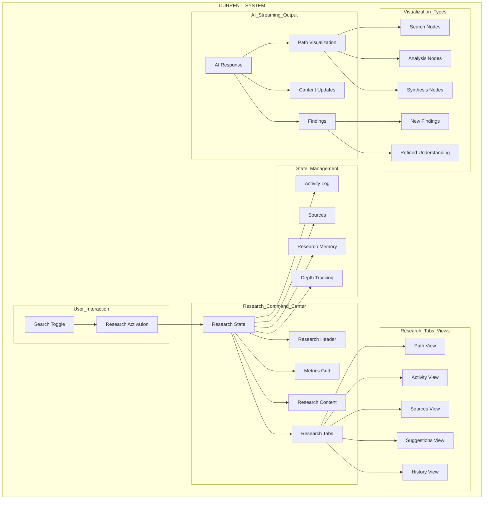
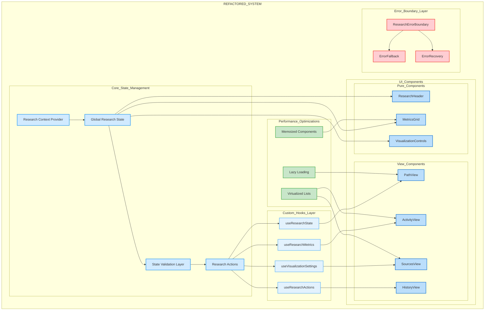
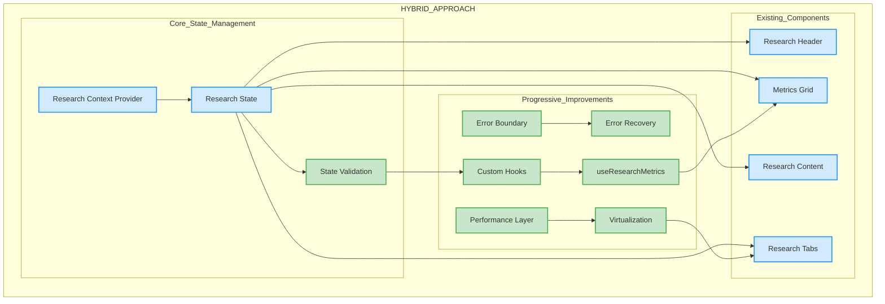

# Research Visualization System - Information Flow Analysis

## 1. Current System Architecture
---

### Current System Notes
- Direct state flow from user interaction to visualization
- Centralized Research Command Center
- Simple but potentially complex state management
- Limited error handling and performance optimizations

## 2. Proposed Refactored Architecture
---

### Refactored System Notes
- Improved separation of concerns
- Dedicated error handling layer
- Performance optimization layer
- Custom hooks for reusable logic
- More complex but more maintainable

## 3. Recommended Hybrid Approach
---

### Hybrid Approach Notes
- Maintains existing component structure
- Gradually introduces improvements
- Balances stability with modernization
- Practical implementation path
- Reduced refactoring risks

### Implementation Phases
1. Add State Validation
2. Introduce Error Boundaries
3. Add Performance Optimizations
4. Create Custom Hooks
