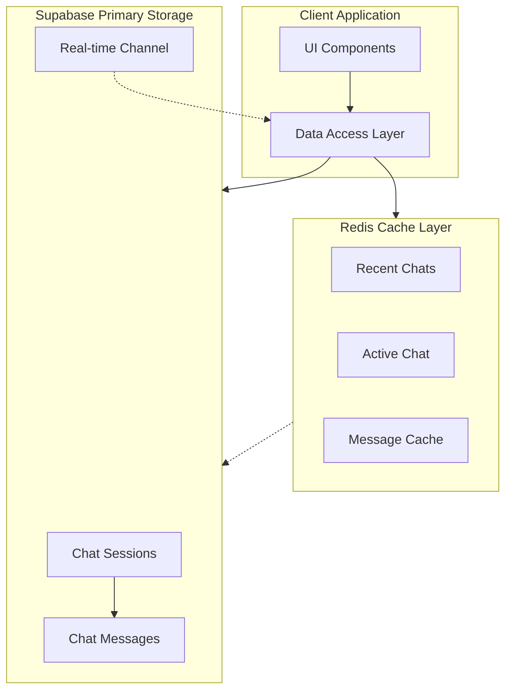
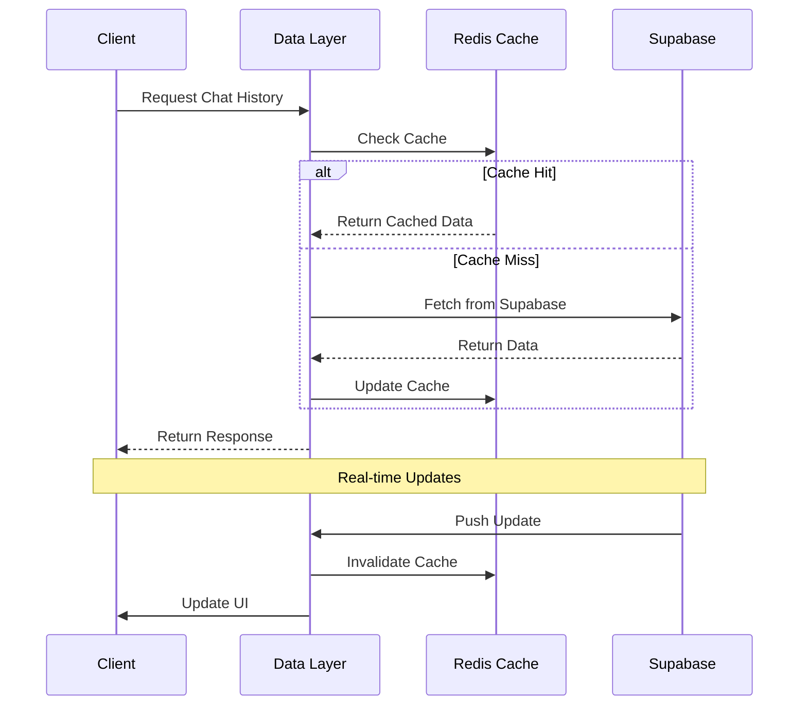
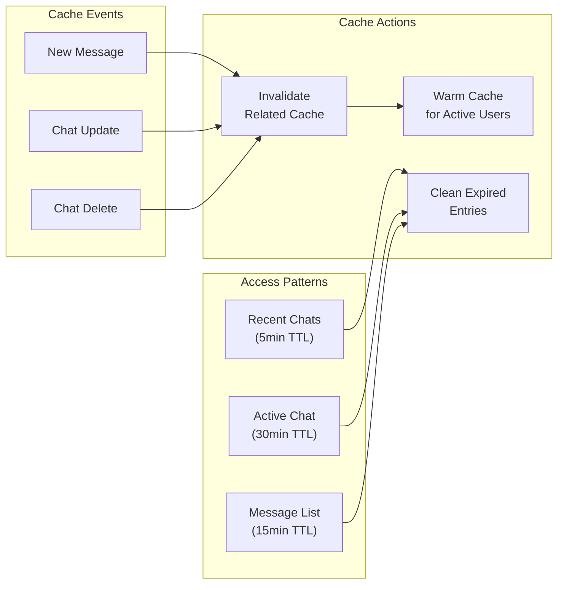

# Redis-Supabase Synchronization Strategy

## Overview

This document outlines our strategy to properly implement a dual-database architecture with Supabase as our primary database and Redis as a caching layer, following industry best practices.

## System Architecture

## Data Flow

## Cache Strategy

## Current Issues

1. **Incorrect Architecture**:
   - Redis is being used as primary storage for chat history
   - No proper data persistence strategy
   - Risk of data loss
   - Memory constraints
   - No proper data relationships

2. **Underutilized Supabase Features**:
   - Not using Supabase as source of truth
   - Missing real-time capabilities
   - Incomplete RLS implementation
   - Not leveraging PostgreSQL features

## Target Architecture

### 1. Data Layer Design

1. **Supabase (Primary Storage)**:
   - Chat sessions table for conversation metadata
   - Chat messages table for individual messages
   - Proper relationships and constraints
   - Row Level Security (RLS) policies
   - Real-time subscriptions

2. **Redis (Caching Layer)**:
   - Recent chats cache
   - Active chat details cache
   - Message list cache
   - Configurable TTLs
   - Memory optimization

### 2. Key Components

1. **Database Structure**:
   - Proper table relationships
   - Optimized indexes
   - Data integrity constraints
   - Efficient query patterns

2. **Caching Strategy**:
   - Cache frequently accessed data
   - Automatic cache invalidation
   - Memory usage limits
   - Cache warming for hot data

3. **Real-time Updates**:
   - Supabase real-time channels
   - Cache invalidation on changes
   - Optimistic UI updates
   - Fallback mechanisms

## Implementation Plan

### Phase 1: Setup (Week 1)
1. Database
   - Create tables and indexes
   - Configure RLS
   - Test performance

2. Monitoring
   - Set up monitoring and logging
   - Configure error tracking

### Phase 2: Migration (Week 2) 
1. Data Migration
   - Create and test migration scripts
   - Validate data integrity
   - Prepare rollbacks

2. Caching
   - Configure Redis caching
   - Implement TTL strategy
   - Test performance

### Phase 3: Integration (Week 2-3)
1. Application
   - Update data layer
   - Add caching and real-time sync
   - Update UI

2. Testing
   - Run unit and integration tests
   - Test performance and load

### Phase 4: Launch (Week 4)
1. Validation
   - Verify data and security
   - Monitor performance

2. Cleanup
   - Remove old data
   - Update docs and train team

## Performance Strategy

1. **Database Optimization**:
   - Query optimization
   - Index management
   - Regular maintenance
   - Connection pooling

2. **Cache Efficiency**:
   - Smart TTL values
   - Memory limits
   - Eviction policies
   - Cache warming

3. **Monitoring Points**:
   - Cache hit rates
   - Query performance
   - Memory usage
   - Error rates

## Security Measures

1. **Database Security**:
   - Row Level Security
   - Access policies
   - Audit logging
   - Data encryption

2. **Cache Security**:
   - Key isolation
   - Memory limits
   - Access controls
   - Data encryption

## Risk Mitigation

1. **Data Loss Prevention**:
   - Regular backups
   - Transaction logging
   - Rollback procedures
   - Data validation

2. **Performance Risks**:
   - Load balancing
   - Cache fallbacks
   - Query optimization
   - Resource monitoring

3. **Security Risks**:
   - Access controls
   - Data encryption
   - Regular audits
   - Security monitoring

## Success Metrics

1. **Performance Metrics**:
   - Response times
   - Cache hit rates
   - Query execution time
   - Memory usage

2. **Reliability Metrics**:
   - Uptime
   - Error rates
   - Data consistency
   - Recovery time

## Next Steps

1. **Immediate Actions**:
   - Create detailed specifications
   - Set up monitoring
   - Begin database setup
   - Create test environment

2. **Team Preparation**:
   - Technical documentation
   - Team training
   - Review processes
   - Support procedures 