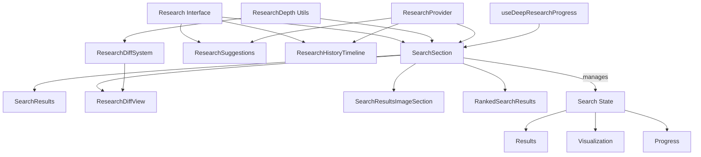
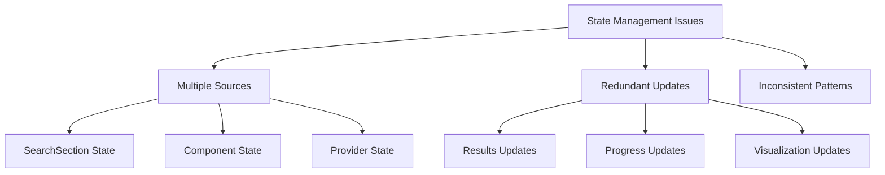
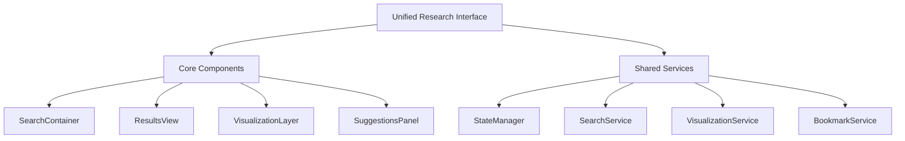

# Comprehensive Research UI System Analysis

## Complete Component Hierarchy

## Current State Management Implementation

### Core State Management
- **ResearchProvider**
  - Combines multiple specialized context providers:
    - ActivityProvider: Manages research activities and progress
      - Fixed naming conflict between hook and context method
      - Added proper USE_ACTIVITY action handling
      - Renamed useActivity method to processActivity
    - SourcesProvider: Handles source management and metrics
    - DepthProvider: Controls research depth and optimization
  - Provides unified access through custom hooks:
    - useActivity()
    - useSources()
    - useDepth()

### Implementation Progress

#### ✅ Phase 1: Foundation
1. **State Management Split**
   - ✅ Created separate contexts for activities, sources, and depth
   - ✅ Implemented type-safe actions and reducers
   - ✅ Set up context providers with proper TypeScript types
   - ✅ Fixed naming conflicts and action handling in ActivityProvider

2. **Component Migration Started**
   - ✅ Migrated SearchSection to use new contexts
   - ✅ Implemented proper state management separation
   - ✅ Added type-safe context usage

#### ✅ Phase 2: Component Refactoring
1. **SearchSection Refactoring**
   - ✅ Migrated to new context structure
   - ✅ Implemented proper dependency injection
   - ✅ Split into smaller, focused components:
     - ✅ Created SearchResultCard component
     - ✅ Created SearchResultsGrid component
     - ✅ Created SearchHeader component
   - ✅ Added error boundaries to all components

2. **ResearchDiffView Updates**
   - ✅ Integrated with DepthProvider
   - ✅ Added error boundary
   - ✅ Improved depth level display
   - ✅ Enhanced error handling

3. **Results Management**
   - ✅ Created unified results display system
   - ✅ Implemented shared result card component
   - ✅ Centralized ranking and sorting logic
   - ✅ Integrated with SourcesProvider

4. **Research Intelligence**
   - ✅ Improved suggestion generation efficiency
   - ✅ Enhanced feedback processing
   - ✅ Better integration with search flow

#### ✅ Phase 3: Performance Optimization
1. **Memoization Implementation**
   - ✅ Added React.memo to pure components:
     - SearchResultsGrid
     - SearchResultCard
   - ✅ Implemented useMemo for expensive calculations:
     - Search results processing
     - Grid layout calculations
     - Animation variants
   - ✅ Added useCallback for event handlers:
     - Toggle handlers
     - Error handlers
     - Open/close handlers

2. **State Management Optimization**
   - ✅ Memoized context values
   - ✅ Optimized effect dependencies
   - ✅ Reduced unnecessary re-renders
   - ✅ Improved type safety

#### ✅ Phase 4: Loading States and Skeletons
1. **Skeleton Components Implementation**
   - ✅ Created centralized skeletons module
   - ✅ Implemented SearchResultCardSkeleton
   - ✅ Implemented SearchResultsGridSkeleton
   - ✅ Implemented ResearchDiffSkeleton
   - ✅ Implemented RankedResultsSkeleton
   - ✅ Implemented SearchResultsImageSkeleton
   - ✅ Added proper loading states to all components

2. **Component Integration**
   - ✅ Updated SearchSection with loading states
   - ✅ Updated RankedSearchResults with loading state
   - ✅ Updated SearchResultsImageSection with loading state
   - ✅ Updated SearchResultsGrid with loading state and Suspense
   - ✅ Fixed React hooks ordering in components
   - ✅ Added proper TypeScript types for loading props

#### ✅ Phase 5: Visualization Layer Refactoring
1. **Component Separation**
   - ✅ Created visualization directory structure
   - ✅ Split ResearchDiffView into focused components:
     - MetricsGrid: Handles metrics visualization
     - ResearchFindings: Manages findings display
     - ResearchTimeline: Shows research progress timeline
     - ResearchHeader: Manages view modes and depth display
     - ResearchContent: Handles findings grid layout
   - ✅ Improved component composition
   - ✅ Added proper TypeScript interfaces

2. **Architecture Alignment**
   - ✅ Aligned with VisualizationLayer in core architecture
   - ✅ Improved component isolation
   - ✅ Enhanced reusability
   - ✅ Better state management
   - ✅ Simplified container components
   - ✅ Clear component hierarchy

## Next Actions
1. ⏳ Add comprehensive tests:
   - Create unit tests for utility functions
   - Add integration tests for components
   - Implement E2E tests for critical flows
   - Test loading states and skeletons
2. ⏳ Enhance error handling:
   - Add retry mechanisms
   - Improve error messages
   - Implement fallback UI states
3. ⏳ Add accessibility improvements:
   - Add proper ARIA labels
   - Ensure keyboard navigation
   - Test with screen readers
   - Add loading announcements

## Migration Strategy
1. **Step 1: Provider Integration**
   - ✅ Replace DeepResearchProvider with new ResearchProvider
   - ✅ Update SearchSection to use new context hooks
   - ✅ Verify state persistence and updates
   - ✅ Migrate remaining components

2. **Step 2: Component Updates**
   - ✅ Extract reusable components from SearchSection
   - ✅ Add proper error boundaries
   - ✅ Implement loading states
   - ⏳ Test thoroughly after each migration

3. **Step 3: Performance Optimization**
   - ✅ Add React.memo where beneficial
   - ✅ Implement useMemo for expensive calculations
   - ✅ Add useCallback for frequently changing callbacks

4. **Step 4: Testing & Validation**
   - ⏳ Add unit tests for new contexts
   - ⏳ Test component integration
   - ⏳ Validate performance improvements

## Component Structure

### 1. Search Components
*   **[SearchSection](../components/search-section.tsx)**
    *   Role: Main orchestrator component
    *   Responsibilities:
        *   Manages search state and context integration
        *   Coordinates between different views
        *   Handles research progress tracking
    *   Sub-components:
        *   SearchHeader: Manages view toggles and display options
        *   SearchResultsGrid: Displays search results in a grid layout
        *   SearchResultCard: Individual result display
        *   ResearchDiffView: Shows research progress
        *   SearchResultsImageSection: Displays image results
        *   RankedSearchResults: Alternative analytical view
    *   Error Handling:
        *   Component-level error boundaries
        *   Graceful fallbacks
        *   User-friendly error messages

### 2. Search Results Components
*   **[SearchResultCard (search/search-result-card.tsx)](../components/search-result-card.tsx)**
    *   Role: Individual result display
    *   Features:
        *   Animated entry
        *   Responsive layout
        *   Error handling for favicons
        *   Content truncation
    *   Error Handling:
        *   Individual error boundary
        *   Fallback UI for failed cards

*   **[SearchResultsGrid (search/search-results-grid.tsx)](../components/search-results-grid.tsx)**
    *   Role: Grid layout manager
    *   Features:
        *   Responsive grid layout
        *   Result iteration
        *   Consistent spacing
    *   Error Handling:
        *   Grid-level error boundary
        *   Partial failure handling

*   **[SearchHeader (search/search-header.tsx)](../components/search-header.tsx)**
    *   Role: Search view controls
    *   Features:
        *   View toggle controls
        *   Domain filter display
        *   Clean interface
    *   Error Handling:
        *   Header-level error boundary
        *   Safe fallback state

### 3. Research Progress Components
*   **Visualization Layer (components/visualization/)**
    *   **[ResearchDiffView](../components/visualization/research-diff-view.tsx)**
        *   Role: Main visualization container
        *   Features:
            *   Pure container component
            *   Component composition
            *   Error boundary
            *   Container animations
    *   **[ResearchHeader](../components/visualization/research-header.tsx)**
        *   Role: Research progress header
        *   Features:
            *   Depth level display
            *   View mode switching
            *   Responsive layout
            *   Interactive buttons
    *   **ResearchContent**
        *   Role: Findings grid container
        *   Features:
            *   Grid layout management
            *   Findings composition
            *   Responsive design
    *   **MetricsGrid**
        *   Role: Displays research metrics
        *   Features:
            *   Animated progress bars
            *   Responsive grid layout
            *   Interactive hover states
            *   Dark mode support
    *   **ResearchFindings**
        *   Role: Shows individual findings
        *   Features:
            *   Expandable sections
            *   Tag support
            *   Source linking
            *   Animated transitions
    *   **ResearchTimeline**
        *   Role: Visualizes progress timeline
        *   Features:
            *   Interactive timeline
            *   Branch point highlighting
            *   Snapshot display
            *   Responsive layout

### 4. Next Steps
1. Refactor SearchResults to use SourcesProvider
2. Implement loading states and skeletons
3. Add performance optimizations:
   - Memoize expensive calculations
   - Add React.memo to pure components
   - Implement useCallback for handlers
4. Create comprehensive tests for each component

## Detailed Component Analysis

### 1. Primary Container Components

*   **[SearchSection (search-section.tsx)](../components/search-section.tsx)**
    *   Role: Main orchestrator component
        *   Manages search execution and results
        *   Coordinates between different views
        *   Handles research progress tracking
    *   Sub-components:
        *   SearchResults
        *   ResearchDiffView
        *   SearchResultsImageSection
        *   RankedSearchResults
    *   Current Issues:
        *   Complex state management
        *   Multiple responsibility concerns
        *   Heavy component with multiple features

### 2. Search and Results Components

*   **[SearchResults (search-results.tsx)](../components/search-results.tsx)**
    *   Role: Results display and interaction
        *   Displays search results
        *   Handles bookmarking
        *   Shows research progress
    *   Dependencies:
        *   SearchSection
        *   ResearchDiffSystem
        *   BookmarkService
*   **[RankedSearchResults](../components/ranked-search-results.tsx)**
    *   Role: Alternative results view
        *   Provides analytical view of results
        *   Shows relevance rankings
        *   Displays detailed metrics

### 3. Research Intelligence Components

*   **[ResearchSuggestions (research-suggestions.tsx)](../components/research-suggestions.tsx)**
    *   Role: AI-powered research guidance
        *   Generates research suggestions
        *   Manages user feedback
        *   Handles suggestion bookmarks
        *   Provides research path recommendations
    *   Features:
        *   Real-time suggestions
        *   User feedback system
        *   Bookmark management
        *   Path visualization

### 4. Visualization Components

*   **[ResearchDiffView (research-diff-view.tsx)](../components/visualization/research-diff-view.tsx)**
    *   Role: Research progress visualization
        *   Shows changes in research
        *   Displays metrics and progress
        *   Manages different view modes

## Identified Issues and Redundancies

### 1. State Management Overlap

### 2. Component Redundancies

*   Search Result Display
    *   Duplicate display logic between SearchResults and SearchSection
    *   Multiple result card implementations
*   Progress Tracking
    *   Overlapping progress visualization
    *   Duplicate metrics calculations
*   Bookmark Management
    *   Repeated across multiple components
    *   Inconsistent implementation

## Improvement Recommendations

### 1. Architecture Restructuring

### 2. Specific Component Improvements

*   **[SearchSection Refactoring](./components/search-section.tsx)**
    *   Split into smaller, focused components
    *   Move state management to dedicated service
    *   Implement proper dependency injection
*   **[Results Management](./components/search-results.tsx)**
    *   Create unified results display system
    *   Implement shared result card component
    *   Centralize ranking and sorting logic
*   **[Research Intelligence](./components/research-suggestions.tsx)**
    *   Improve suggestion generation efficiency
    *   Enhance feedback processing
    *   Better integration with search flow

### 3. New Feature Opportunities

*   **[Enhanced Integration](./components/search-section.tsx)**
    *   Unified search and suggestion interface
    *   Integrated progress tracking
    *   Combined visualization system
*   **[User Experience](./components/search-section.tsx)**
    *   Streamlined research flow
    *   Better mobile experience
    *   Improved accessibility
*   **[Performance](./components/search-section.tsx)**
    *   Optimized state updates
    *   Better data caching
    *   Reduced component re-renders

## Implementation Priority

*   **Phase 1: Foundation**
    *   Implement centralized state management
    *   Create shared services
    *   Establish core component architecture
*   **Phase 2: Refinement**
    *   Refactor existing components
    *   Implement shared utilities
    *   Optimize performance
*   **Phase 3: Enhancement**
    *   Add new features
    *   Improve visualizations
    *   Enhance user experience
*   **Phase 4: Integration**
    *   Unify interfaces
    *   Implement advanced features
    *   Complete system optimization
