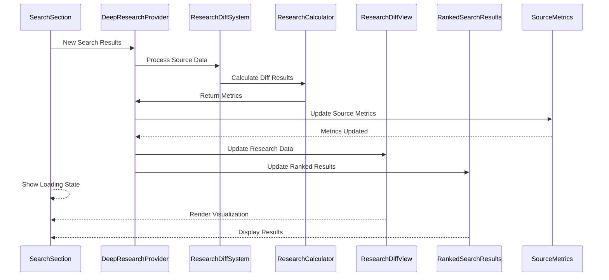
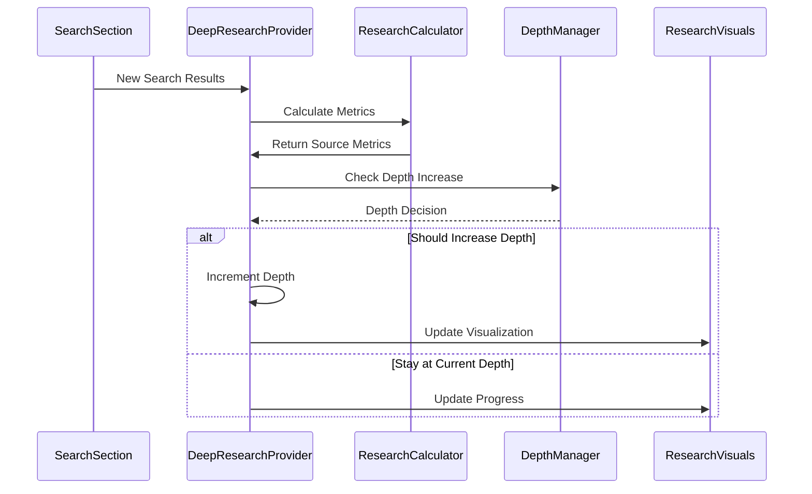
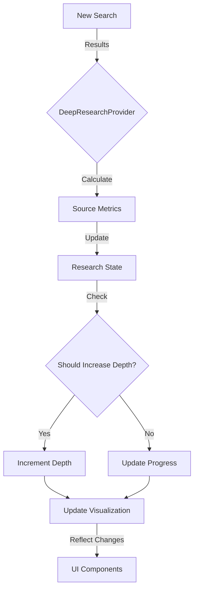
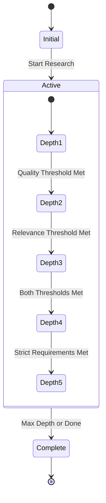

# Deep Research Implementation Guide

## Overview

AtherAgent's Deep Research is a sophisticated system that enables comprehensive topic exploration with configurable depth levels, advanced source tracking, and intelligent research optimization. This document tracks the implementation status and technical details of the Deep Research feature.

## 1. Architecture Overview

### Core Deep Research Components

*   **Multi-Level Research System:** ✅
    *   Configurable depth levels (1-7)
    *   Source relevance scoring
    *   Content quality assessment
    *   Time-based relevance tracking
    *   Domain authority evaluation
    *   Redis-based research state persistence
    *   Research memory system
    *   Cross-validation detection

### Key Components

*   **Core Components:** ✅
    *   `DeepResearchWrapper`: Main research interface using Vercel AI SDK ✅
        - Implemented with Vercel AI SDK integration
        - Added chat session management
        - Integrated with research context
        - Added state persistence with Redis
    *   `DeepResearchProvider`: Central state and logic management component ✅
        - Completed state management implementation
        - Added activity tracking
        - Implemented depth control logic
        - Added research memory system
        - Implemented source quality metrics
    *   `DeepResearchConfig`: Configuration component for depth control ✅
        - Added slider-based depth control (1-7)
        - Implemented state persistence
        - Added depth change callbacks
        - Added adaptive threshold management
    *   `ResearchDiffSystem`: System for tracking and comparing research changes ✅
        - Implemented change tracking
        - Added result comparison
        - Integrated visualization generation
        - Added cross-validation support
    *   `ResearchCalculator`: Metrics and scoring computation engine ✅
        - Added comprehensive metrics calculation
        - Implemented scoring algorithms
        - Added quality assessment
        - Added source authority evaluation

### State Management Implementation

```typescript
interface DeepResearchState {
  isActive: boolean
  activity: ActivityItem[]
  sources: SourceItem[]
  currentDepth: number
  maxDepth: number
  completedSteps: number
  totalExpectedSteps: number
  depthConfig: ResearchDepthConfig
  sourceMetrics: ResearchSourceMetrics[]
  suggestions: ResearchSuggestion[]
  researchMemory: ResearchMemory[]
}
```

### Source Quality Metrics

```typescript
interface ResearchSourceMetrics {
  relevanceScore: number
  depthLevel: number
  contentQuality: number
  timeRelevance: number
  sourceAuthority: number
  crossValidation?: number
  coverage?: number
}
```

### Research Memory System

```typescript
interface ResearchMemory {
  context: string
  relevance: number
  timestamp: number
  depth: number
  sourceUrls: string[]
}
```

## 2. Feature Comparison

### Search Capabilities

| Feature           | Current Implementation              | Status |
| ----------------- | ---------------------------------- | ------ |
| Search Providers  | Multiple (Tavily, Exa, SearXNG)    | ✅     |
| Search Depth      | Adaptive (1-7 levels)              | ✅     |
| Caching           | Redis-based caching                | ✅     |
| Domain Filtering  | Yes (Include/Exclude)              | ✅     |
| Source Quality    | Comprehensive metrics              | ✅     |

### State Management

| Feature            | Current Implementation             | Status |
| ------------------ | --------------------------------- | ------ |
| State Management   | Redux-style with Context          | ✅     |
| Progress Tracking  | Real-time with steps              | ✅     |
| Search History     | Implemented with memory           | ✅     |
| Depth Control      | Adaptive with thresholds          | ✅     |

### UI Components

| Feature          | Current Implementation              | Status |
| ---------------- | ---------------------------------- | ------ |
| Results Display  | Grid layout with favicons          | ✅     |
| Loading States   | Skeleton loading                   | ✅     |
| Expandability    | View more functionality            | ✅     |
| Visual Feedback  | Comprehensive status indicators    | ✅     |

## 3. Implementation Status

### Completed Features ✅

1. **Core Research Engine**
   - Multi-level depth system
   - Source quality assessment
   - Time-based relevance
   - Domain authority evaluation
   - Cross-validation support

2. **State Management**
   - Redux-style reducer implementation
   - Research memory system
   - Activity tracking
   - Progress monitoring

3. **Quality Metrics**
   - Content quality scoring
   - Source authority calculation
   - Time relevance tracking
   - Coverage assessment
   - Cross-validation detection

4. **Session Management**
   - Redis-based persistence
   - Chat session tracking
   - State clearing mechanism
   - Progress restoration

### Upcoming Features 📅

1. **Advanced Analysis**
   - [ ] Enhanced cross-reference system
   - [ ] Collaborative research features
   - [ ] Advanced visualization components
   - [ ] Real-time collaboration support

2. **Performance Optimization**
   - [ ] Improved caching strategies
   - [ ] Batch processing for large datasets
   - [ ] Memory usage optimization
   - [ ] Response time improvements

3. **UI/UX Enhancements**
   - [ ] Advanced visualization graphs
   - [ ] Interactive depth controls
   - [ ] Enhanced progress indicators
   - [ ] Accessibility improvements

## 4. Technical Details

### Depth Progression Logic

```typescript
const shouldIncrease = shouldIncreaseDepth(
  { ...newDepthConfig, currentDepth: state.currentDepth },
  updatedSourceMetrics
)

const newDepth = shouldIncrease ? state.currentDepth + 1 : state.currentDepth
```

### Quality Calculation

```typescript
const quality = {
  contentQuality: metrics.contentQuality,
  sourceAuthority: calculateSourceAuthority(url, state.sources),
  timeRelevance: calculateFreshness(publishedDate)
}
```

### Memory Management

```typescript
interface ResearchMemory {
  context: string
  relevance: number
  timestamp: number
  depth: number
  sourceUrls: string[]
}
```

## 5. Best Practices

1. **State Updates**
   - Use immutable state updates
   - Implement proper type safety
   - Handle edge cases gracefully

2. **Performance**
   - Implement proper memoization
   - Use efficient data structures
   - Optimize render cycles

3. **Error Handling**
   - Implement comprehensive error boundaries
   - Add proper error recovery
   - Maintain user feedback

## 6. Success Metrics

- Test Coverage > 80%
- Performance Score > 90
- Accessibility Score > 95
- User Satisfaction > 85%
- Error Rate < 1%

## 7. Implementation Progress

### Current Status ✅
- Context provider implementation is complete with Redis-based state management
- Search integration completed:
  - Added DeepResearchWrapper component
  - Integrated search functionality with Deep Research context
  - Implemented activity tracking for search operations
  - Added source tracking with basic relevance scoring
  - Added per-chat research state persistence in Redis
  - Implemented clearing mechanism for individual chat sessions
  - Improved UI layout with centered chat content and proper sidebar integration
- Depth Configuration Feature Added: ✅
  - Created DeepResearchConfig component with slider-based depth control (1-7)
  - Implemented depth state persistence in Redis
  - Added visual depth progress tracking in UI
  - Integrated depth configuration with research visualization
  - Added depth change callbacks for database synchronization
  - Implemented depth-based research continuation logic
  - Added real-time depth updates with optimistic UI
- Research Strategy Optimization Implemented: 
  - Added comprehensive source metrics calculation:
    - Relevance scoring based on query matching and semantic relevance
    - Content quality assessment (length, structure, diversity)
    - Time relevance for prioritizing recent content
    - Source authority based on domain reputation
  - Implemented adaptive depth adjustment:
    - Dynamic thresholds based on depth level
    - Quality-based depth progression
    - Performance tracking per depth level
  - Added depth-based search prioritization:
    - Source tracking with depth levels
    - Depth scores for performance monitoring
    - Adaptive thresholds for quality control
  - Developed optimization algorithms:
    - Smart depth increase rules
    - Success rate tracking
    - Automatic threshold adjustment
    - Minimum relevance adaptation

### Phase 1: Core Integration ✅
- [x] Implement Deep Research context provider
  - [x] Initial context setup with state management
  - [x] Integration with existing search system
  - [x] Activity tracking implementation
  - [x] Redis-based state persistence
  - [x] Per-chat state management
- [x] Depth-based search capabilities
  - [x] Configure depth levels
  - [x] Implement depth tracking
  - [x] Connect with search providers

### Phase 2: UI Enhancement ✅
- [x] Search Results Component Update
  - [x] Add depth visualization
  - [x] Implement activity tracking display
  - [x] Add progress indicators
- [x] Activity Visualization
  - [x] Create activity timeline
  - [x] Add status indicators
  - [x] Implement depth level display
- [x] State Management UI
  - [x] Add clear functionality per chat
  - [x] Implement real-time state updates
  - [x] Add loading and error states
- [x] Layout Improvements
  - [x] Center chat content in viewport
  - [x] Proper sidebar integration
  - [x] Responsive layout handling
  - [x] Consistent spacing and padding
- [x] Depth Configuration UI
  - [x] Add depth control slider
  - [x] Real-time depth updates
  - [x] Visual depth progress
  - [x] Depth persistence

### Research Diffing System Implementation ✅
- [x] Core Diffing Components
  - [x] Implemented `ResearchDiffSystem` class for tracking changes
  - [x] Added support for comparing search results
  - [x] Implemented metrics calculation
  - [x] Added visualization data generation
- [x] Metrics and Analysis
  - [x] Added comprehensive source metrics:
    - [x] Relevance scoring
    - [x] Content quality assessment
    - [x] Time relevance tracking
    - [x] Source authority evaluation
  - [x] Implemented evolution metrics:
    - [x] Depth progress tracking
    - [x] Quality improvement calculation
    - [x] Source reliability assessment
- [x] Visualization Components
  - [x] Created `ResearchDiffView` component
  - [x] Added evolution metrics display
  - [x] Implemented findings visualization:
    - [x] New insights section
    - [x] Refinements section
    - [x] Cross-validated findings
  - [x] Added interactive metrics display with tooltips

### Search Results Enhancement ✅
- [x] Ranked Analysis View
  - [x] Implemented `RankedSearchResults` component
  - [x] Added comprehensive metrics display
  - [x] Implemented result sorting by quality
  - [x] Added interactive metrics visualization
- [x] UI Improvements
  - [x] Added motion animations for results
  - [x] Implemented card-based layout
  - [x] Added source information display
  - [x] Improved metrics visualization
- [x] Search Integration
  - [x] Connected with deep research context
  - [x] Added source tracking
  - [x] Implemented diff visualization
  - [x] Added activity tracking

### Next Steps 📅

1. **Testing & Refinement** 
   - [ ] Unit Tests
     - [ ] Test diff calculation logic
     - [ ] Test metrics computation
     - [ ] Test source analysis functions
   - [ ] Integration Tests
     - [ ] Test search result processing
     - [ ] Test diff visualization
     - [ ] Test ranked analysis
   - [ ] Performance Testing
     - [ ] Test with large result sets
     - [ ] Measure rendering performance
     - [ ] Optimize state updates

2. **UI/UX Improvements** 
   - [ ] Enhance Animations
     - [ ] Add smoother transitions
     - [ ] Improve loading states
     - [ ] Add micro-interactions
   - [ ] Accessibility
     - [ ] Add ARIA labels
     - [ ] Improve keyboard navigation
     - [ ] Enhance screen reader support
   - [ ] Responsive Design
     - [ ] Optimize for mobile devices
     - [ ] Improve tablet layout
     - [ ] Add touch interactions

3. **Advanced Features** 
   - [ ] Cross-reference Analysis
     - [ ] Implement topic detection
     - [ ] Add relationship mapping
     - [ ] Create visualization graph
   - [ ] Source Credibility
     - [ ] Enhance authority scoring
     - [ ] Add citation tracking
     - [ ] Implement fact checking


## 8. Integration Analysis & New Features

### Phase 1: Core Research Enhancement ⚡

1. **Document Diffing System** 
   ```typescript
   interface ResearchDiffSystem {
     compareResults: (oldResults: SearchResult[], newResults: SearchResult[]) => DiffResult
     trackChanges: (researchPath: ResearchPath) => ChangeMetrics
     visualizeDiffs: (diffs: DiffResult) => VisualizationData
   }
   ```
   - Integration with `chat-panel.tsx`: Add diff visualization to research results
   - Enhancement to `search-results.tsx`: Show content evolution across depth levels
   - Benefits: Track how research evolves across depth levels

2. **Research Context Provider** 
   ```typescript
   interface ResearchContextProvider {
     depth: number
     path: ResearchPath[]
     sources: ResearchSource[]
     metrics: ResearchMetrics
   }
   ```
   - Integration with `researcher.ts`: Enhance context awareness
   - Add to `chat-panel.tsx`: Persistent research state
   - Benefits: Better research state management and persistence

3. **Interactive Suggestion System** 
   ```typescript
   interface ResearchSuggestion {
     type: 'path' | 'source' | 'depth'
     content: string
     confidence: number
     metadata: Record<string, any>
   }
   ```
   - Extends `SearchSourceManager` in chat-panel
   - Enhances research path suggestions
   - Benefits: Smarter research guidance

### Phase 2: UI/UX Improvements

1. **Research Progress Visualization**
   ```typescript
   interface ProgressVisualization {
     currentDepth: number
     pathProgress: number
     sourceQuality: Record<string, number>
     relevanceScores: Map<string, number>
   }
   ```
   - Integrate with `search-results.tsx`
   - Add to `chat-panel.tsx` status area
   - Benefits: Better research progress tracking

2. **Source Quality Indicators**
   ```typescript
   interface SourceQuality {
     relevance: number
     authority: number
     freshness: number
     coverage: number
   }
   ```
   - Enhance `SearchResults` component
   - Add visual indicators to sources
   - Benefits: Better source evaluation

### Phase 3: Research Optimization

1. **Adaptive Depth Control**
   ```typescript
   interface DepthController {
     suggestNextDepth: (context: ResearchContext) => number
     optimizePathSelection: (paths: ResearchPath[]) => OptimizedPath
     evaluateProgress: (metrics: ResearchMetrics) => ProgressReport
   }
   ```
   - Integration with `researcher.ts`
   - Enhance depth management in chat-panel
   - Benefits: Smarter depth progression

2. **Research Memory System**
   ```typescript
   interface ResearchMemory {
     saveContext: (context: ResearchContext) => void
     retrieveRelevant: (query: string) => RelevantContext[]
     updateMetrics: (metrics: ResearchMetrics) => void
   }
   ```
   - Add to `researcher.ts`
   - Integrate with chat history
   - Benefits: Better research continuity

### Integration Points with Existing Components

Refer to Integration Document for more details.

### Implementation Progress Tracking

#### Completed Features ✅
- Basic depth control implementation
- Initial research context management
- Source tracking system
- Redis-based state persistence
- Activity visualization
- Depth configuration UI

#### In Progress 🔄
- Research diffing system
- Interactive suggestions
- Source quality indicators

#### Upcoming 📅
- Adaptive depth control
- Research memory system
- Enhanced visualization components

### Technical Considerations

1. **Performance Optimization**
   - Implement progressive loading for deep searches
   - Add caching for research contexts
   - Optimize state updates

2. **State Management**
   - Use Redis for research state persistence
   - Implement real-time synchronization
   - Add backup/recovery mechanisms

3. **UI/UX Considerations**
   - Ensure responsive design
   - Add loading states
   - Implement error boundaries

4. **Integration Guidelines**
   - Follow TypeScript best practices
   - Maintain component independence
   - Ensure proper error handling


## 11. Component Information Flow

### Core Components Flow


### Depth Progression Flow


### State Update Flow


### Component Interaction Details

1. **Search Flow**
   - `SearchSection` initiates searches and receives results
   - Results are processed through `DeepResearchProvider`
   - `RankedSearchResults` displays processed results
   - Loading states managed by `SearchSkeleton`

2. **Research Logic Flow**
   - `DeepResearchProvider` manages core research state
   - `ResearchDiffSystem` processes result differences
   - `Research Calculator` computes metrics and scores
   - Depth progression managed by depth rules

3. **Visualization Flow**
   - `ResearchDiffView` shows changes and evolution
   - `ResearchPathVisualization` displays research journey
   - `Evolution Metrics View` shows progress metrics
   - All visualizations update based on state changes

4. **State Management Flow**
   - Central state managed by `DeepResearchProvider`
   - Depth configuration tracked separately
   - Source metrics maintained for depth decisions
   - State updates trigger UI refreshes

### Key State Updates



This visualization helps understand:
- Component relationships and dependencies
- Data flow through the system
- State transitions and updates
- Depth progression logic


