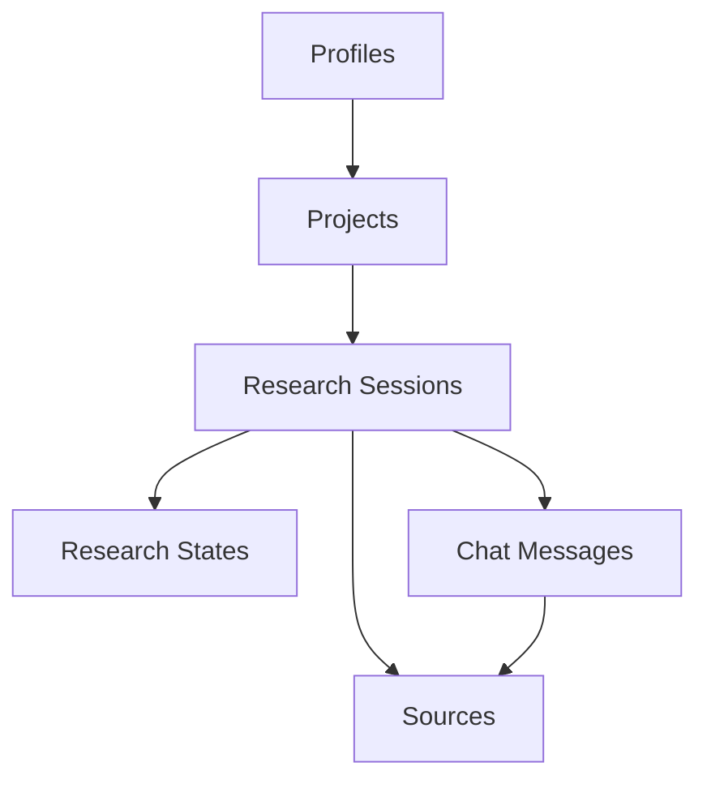

# AtherAgent Database Architecture

## Overview
This document outlines the complete database architecture for the AtherAgent system, detailing table structures, relationships, and implementation details. This serves as the master reference for AI Agents to understand and interact with the database schema.

## Core Tables

### 1. Profiles Table
- **Purpose**: Stores user profile information and preferences
- **Key Features**: 
  - UUID-based identification
  - User preferences in JSONB
  - Research settings
- **Details**: [SQL_Create_profiles_db.md](SQL_Create_profiles_db.md)

### 2. Projects Table
- **Purpose**: Manages research projects and their metadata
- **Key Features**:
  - Project organization and status tracking
  - Team collaboration support
  - Research session management
- **Details**: [SQL_Create_projects_db.md](SQL_Create_projects_db.md)

### 3. Research Sessions Table
- **Purpose**: Tracks individual research sessions
- **Key Features**:
  - Links projects to research activities
  - Maintains session metadata
  - Connects to chat messages and sources
- **Details**: [SQL_Create_research_sessions_db.md](SQL_Create_research_sessions_db.md)

### 4. Research States Table
- **Purpose**: Maintains the state and progress of research sessions
- **Key Features**:
  - Current step tracking
  - Visualization data storage
  - Research metrics
- **Details**: [SQL_Create_research_states_db.md](SQL_Create_research_states_db.md)

### 5. Chat Messages Table
- **Purpose**: Stores all chat interactions and research outputs
- **Key Features**:
  - Message threading
  - Multiple message types
  - Search result storage
- **Details**: [SQL_Create_chat_messages_db.md](SQL_Create_chat_messages_db.md)

### 6. Sources Table
- **Purpose**: Manages research sources and references
- **Key Features**:
  - Source metadata storage
  - Relevance scoring
  - Session linking
- **Details**: [SQL_Create_sources_db.md](SQL_Create_sources_db.md)

## Database Relationships



## Table Schemas

### Profiles
```sql
CREATE TABLE profiles (
    id UUID PRIMARY KEY REFERENCES auth.users(id),
    updated_at TIMESTAMPTZ,
    username TEXT UNIQUE,
    full_name TEXT,
    avatar_url TEXT,
    website TEXT,
    research_preferences JSONB DEFAULT '{}'::jsonb,
    last_active_at TIMESTAMPTZ,
    role TEXT DEFAULT 'user',
    settings JSONB DEFAULT '{}'::jsonb,
    email TEXT,
    is_active BOOLEAN DEFAULT true
);
```

### Projects
```sql
CREATE TABLE projects (
    id UUID PRIMARY KEY DEFAULT uuid_generate_v4(),
    user_id UUID REFERENCES profiles(id),
    name TEXT,
    description TEXT,
    created_at TIMESTAMPTZ DEFAULT now(),
    updated_at TIMESTAMPTZ DEFAULT now(),
    status TEXT DEFAULT 'active',
    project_type TEXT,
    settings JSONB DEFAULT '{}'::jsonb,
    metadata JSONB DEFAULT '{}'::jsonb,
    team_members UUID[] DEFAULT ARRAY[]::UUID[],
    owner_id UUID REFERENCES profiles(id),
    research_sessions UUID[] DEFAULT ARRAY[]::UUID[],
    last_active_session_id UUID,
    tags TEXT[] DEFAULT ARRAY[]::TEXT[],
    priority INTEGER DEFAULT 0,
    due_date TIMESTAMPTZ
);
```

### Research Sessions
```sql
CREATE TABLE research_sessions (
    id UUID PRIMARY KEY DEFAULT uuid_generate_v4(),
    user_id UUID REFERENCES profiles(id),
    project_id UUID REFERENCES projects(id),
    name TEXT,
    description TEXT,
    created_at TIMESTAMPTZ DEFAULT now(),
    updated_at TIMESTAMPTZ DEFAULT now(),
    metadata JSONB DEFAULT '{}'::jsonb
);
```

### Research States
```sql
CREATE TABLE research_states (
    id UUID PRIMARY KEY DEFAULT uuid_generate_v4(),
    session_id UUID REFERENCES research_sessions(id) ON DELETE CASCADE,
    current_step INTEGER DEFAULT 1,
    previous_result JSONB DEFAULT '{}'::jsonb,
    visualization_data JSONB DEFAULT '{}'::jsonb,
    metrics JSONB DEFAULT '{}'::jsonb,
    updated_at TIMESTAMPTZ DEFAULT now(),
    CONSTRAINT research_states_session_id_key UNIQUE(session_id)
);
```

### Chat Messages
```sql
CREATE TABLE chat_messages (
    id UUID PRIMARY KEY DEFAULT uuid_generate_v4(),
    user_id UUID REFERENCES profiles(id),
    research_session_id UUID REFERENCES research_sessions(id),
    message_type message_type,
    content TEXT,
    metadata JSONB DEFAULT '{}'::jsonb,
    parent_message_id UUID REFERENCES chat_messages(id),
    thread_id UUID,
    sequence_number BIGINT,
    created_at TIMESTAMPTZ DEFAULT now(),
    updated_at TIMESTAMPTZ DEFAULT now(),
    search_query TEXT,
    search_source TEXT,
    tool_name TEXT,
    is_visible BOOLEAN DEFAULT true,
    is_edited BOOLEAN DEFAULT false,
    depth_level INTEGER DEFAULT 1
);
```

### Sources
```sql
CREATE TABLE sources (
    id UUID PRIMARY KEY DEFAULT uuid_generate_v4(),
    session_id UUID REFERENCES research_sessions(id),
    message_id UUID REFERENCES chat_messages(id),
    url TEXT,
    title TEXT,
    content TEXT,
    relevance NUMERIC DEFAULT 0,
    metadata JSONB DEFAULT '{}'::jsonb,
    created_at TIMESTAMPTZ DEFAULT now(),
    is_processed BOOLEAN DEFAULT false
);
```

## Common Queries

### Get Project with Research Sessions
```sql
SELECT 
    p.*,
    json_agg(rs.*) as research_sessions
FROM projects p
LEFT JOIN research_sessions rs ON rs.project_id = p.id
WHERE p.id = [project_id]
GROUP BY p.id;
```

### Get Research Session with States and Messages
```sql
SELECT 
    rs.*,
    rst.current_step,
    rst.visualization_data,
    json_agg(cm.*) as messages
FROM research_sessions rs
LEFT JOIN research_states rst ON rst.session_id = rs.id
LEFT JOIN chat_messages cm ON cm.research_session_id = rs.id
WHERE rs.id = [session_id]
GROUP BY rs.id, rst.id;
```

### Get Sources for a Message
```sql
SELECT s.*
FROM sources s
WHERE s.message_id = [message_id]
ORDER BY s.relevance DESC;
```

## Security Policies

All tables implement Row Level Security (RLS) with the following general policies:
- Read access: Authenticated users can read their own data
- Write access: Users can only modify their own data
- Admin access: Special privileges for admin roles

## Maintenance Notes

1. Regular VACUUM ANALYZE recommended for performance
2. Monitor JSONB column sizes
3. Keep indexes updated based on query patterns
4. Regular backup of all research data

## Type Definitions

### Message Types
```sql
CREATE TYPE message_type AS ENUM (
    'user_prompt',
    'ai_response',
    'search_results',
    'summary',
    'error',
    'system'
);
```

## Implementation Guidelines for AI Agents

1. Always use UUID for entity references
2. Store complex data in JSONB columns
3. Maintain referential integrity
4. Use appropriate indexes for frequent queries
5. Follow the established naming conventions
6. Implement proper error handling
7. Use transaction blocks for multi-table operations

## Performance Considerations

1. Use appropriate indexes
2. Implement efficient joins
3. Optimize JSONB queries
4. Monitor query performance
5. Regular maintenance 