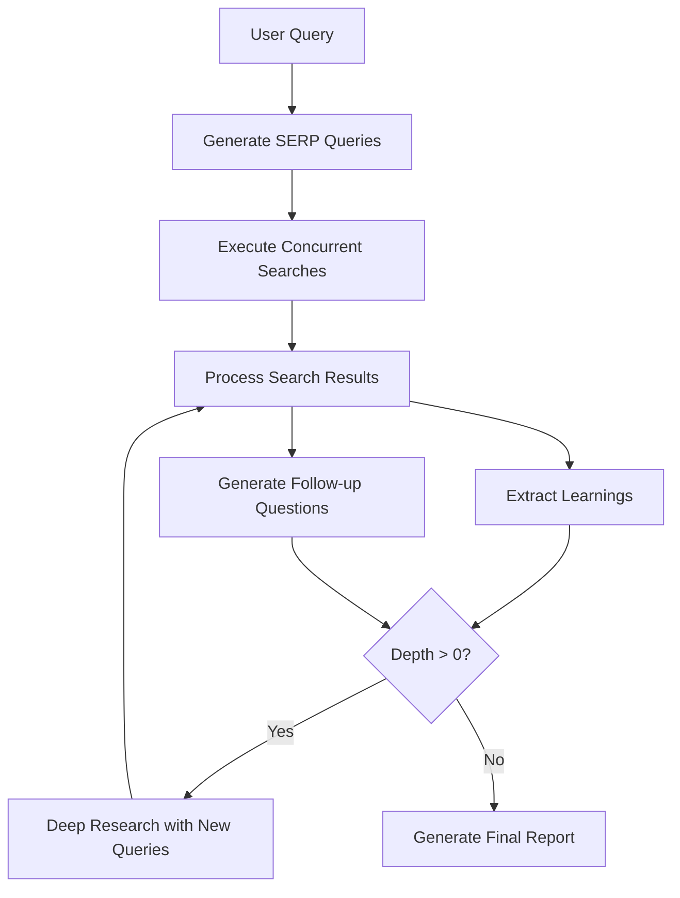
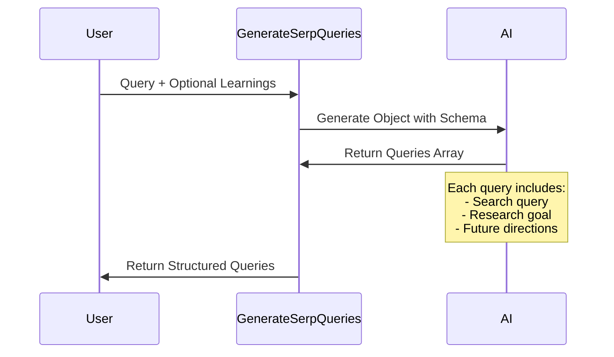
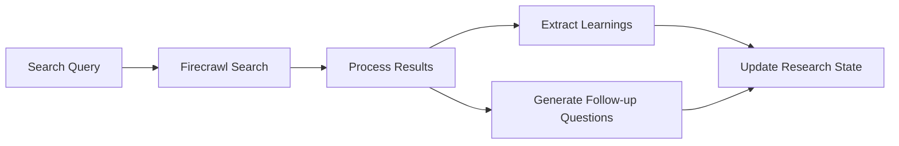
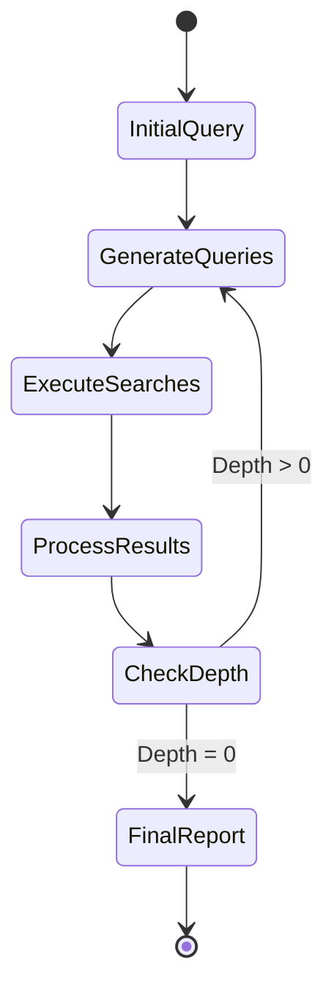
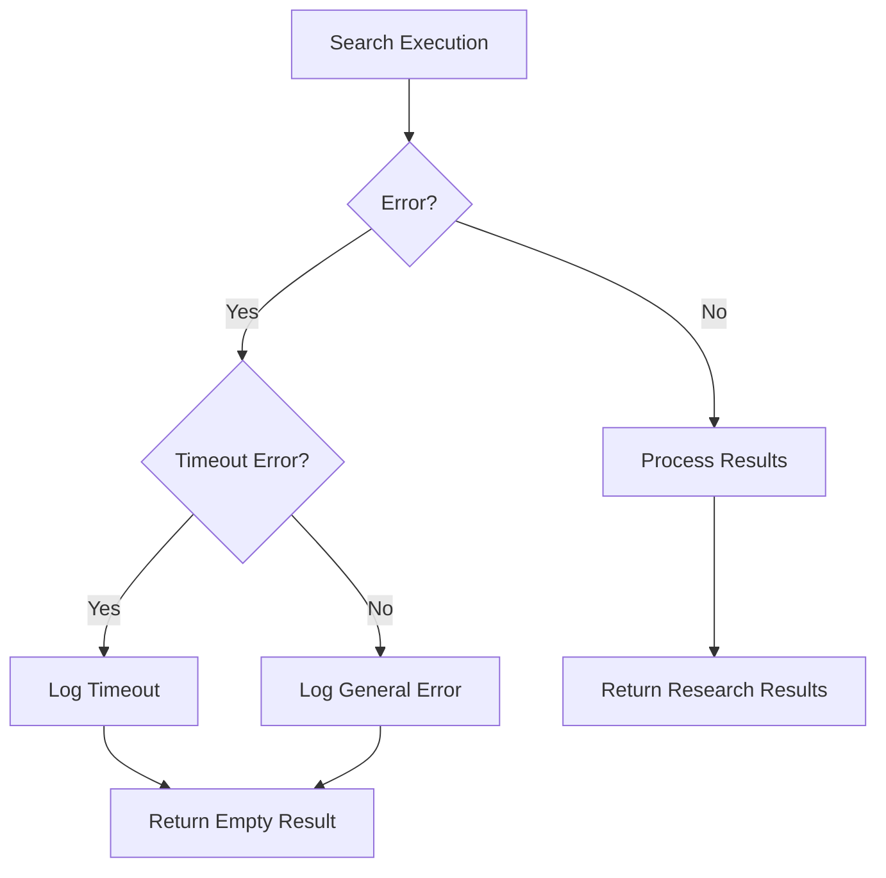

# Deep Research Codebase Explanation

This document provides a detailed explanation of the deep-research codebase, which implements an advanced research system that performs iterative, depth-first research on a given topic.

## System Overview

The system is designed to perform deep research by:
1. Breaking down a user query into multiple search queries
2. Executing these queries concurrently
3. Processing and learning from the results
4. Generating follow-up questions
5. Recursively continuing the research process
6. Finally generating a comprehensive report



## Core Components

### 1. Query Generation


### 2. Search and Processing Flow


### 3. Recursive Research Process


## Prompt Engineering Analysis

The codebase uses sophisticated prompt engineering techniques across different components:

### 1. SERP Query Generation Prompt Structure
```typescript
`Given the following prompt from the user, generate a list of SERP queries to research the topic. 
Return a maximum of ${numQueries} queries, but feel free to return less if the original prompt is clear. 
Make sure each query is unique and not similar to each other: 
<prompt>${query}</prompt>

${learnings ? 
  `Here are some learnings from previous research, use them to generate more specific queries: 
   ${learnings.join('\n')}` 
  : ''}`
```

Key aspects:
- Clear instruction structure
- XML-like tags for content separation
- Dynamic incorporation of previous learnings
- Emphasis on uniqueness and specificity

### 2. Content Processing Prompt Structure
```typescript
`Given the following contents from a SERP search for the query <query>${query}</query>, 
generate a list of learnings from the contents. 
Return a maximum of ${numLearnings} learnings, but feel free to return less if the contents are clear. 
Make sure each learning is unique and not similar to each other. 
The learnings should be concise and to the point, as detailed and information dense as possible. 
Make sure to include any entities like people, places, companies, products, things, etc in the learnings, 
as well as any exact metrics, numbers, or dates. 
The learnings will be used to research the topic further.

<contents>${contents.map(content => 
  `<content>\n${content}\n</content>`).join('\n')
}</contents>`
```

Key aspects:
- Structured content wrapping
- Clear expectations for output
- Emphasis on information density
- Specific requirements for entity inclusion

### 3. Final Report Generation Prompt Structure
```typescript
`Given the following prompt from the user, write a final report on the topic using the learnings from research. 
Make it as as detailed as possible, aim for 3 or more pages, include ALL the learnings from research:

<prompt>${prompt}</prompt>

Here are all the learnings from previous research:

<learnings>
${learningsString}
</learnings>`
```

Key aspects:
- Clear formatting expectations
- Length guidance
- Structured input sections
- Emphasis on comprehensiveness

## Implementation Details

### Concurrency Management
The system uses `pLimit` to manage concurrent searches with a default limit of 2:
```typescript
const ConcurrencyLimit = 2;
const limit = pLimit(ConcurrencyLimit);
```

### Error Handling


### Schema Validation
The codebase uses Zod for runtime type safety:
```typescript
schema: z.object({
    queries: z.array(z.object({
        query: z.string(),
        researchGoal: z.string()
    }))
})
```

## Best Practices for Replication

To replicate this system in another application:

1. **Prompt Structure**
   - Use XML-like tags to separate different types of content
   - Provide clear, specific instructions
   - Include examples when possible
   - Structure output requirements clearly

2. **Error Handling**
   - Implement timeouts for external calls
   - Handle rate limiting gracefully
   - Provide fallback mechanisms

3. **Concurrency**
   - Implement rate limiting
   - Use concurrent processing where appropriate
   - Handle failed requests gracefully

4. **Data Processing**
   - Implement content trimming for large texts
   - Use schema validation for structured data
   - Maintain state across recursive calls

5. **Research Flow**
   - Implement depth and breadth controls
   - Track visited sources
   - Accumulate learnings progressively
   - Generate follow-up questions based on context

## Conclusion

This codebase implements a sophisticated research system that combines:
- Advanced prompt engineering
- Concurrent processing
- Recursive depth-first research
- Structured data validation
- Error handling
- State management

The system can be adapted for various research-intensive applications by modifying the prompt structures and adjusting the depth and breadth parameters to suit specific needs. 