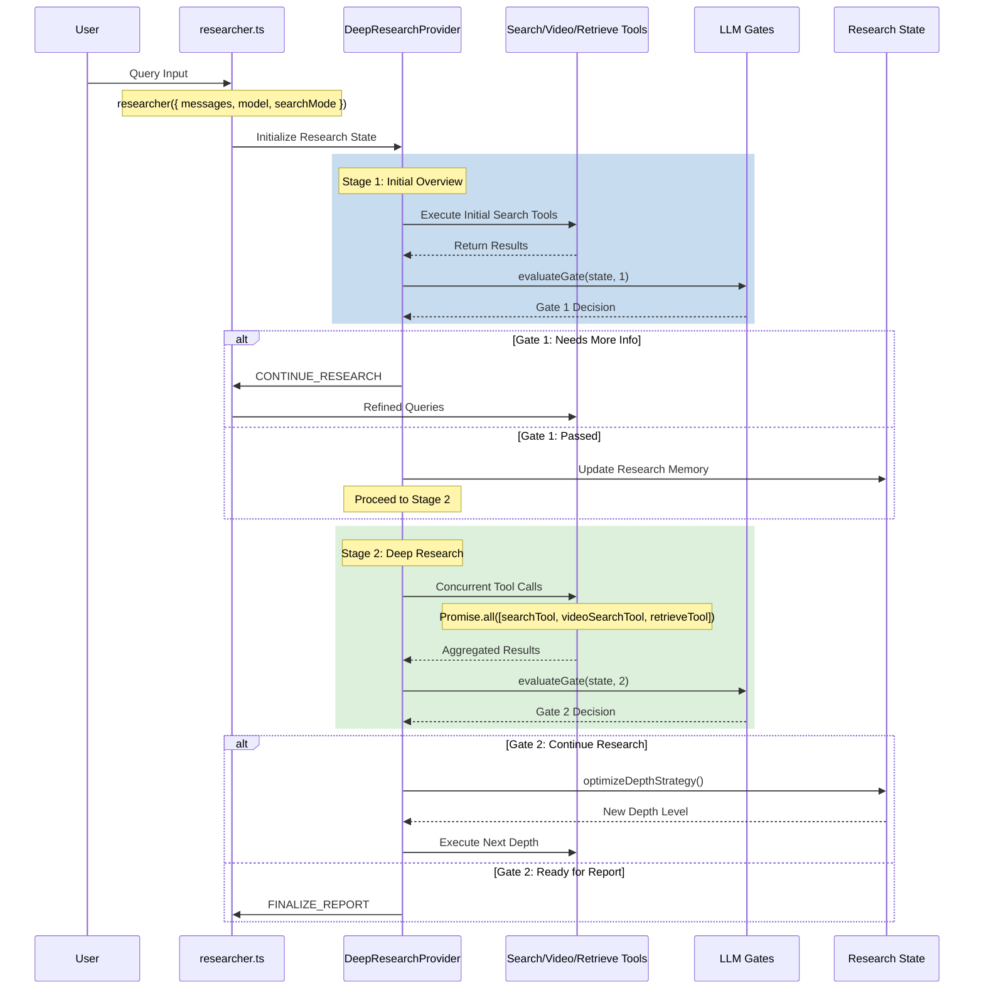
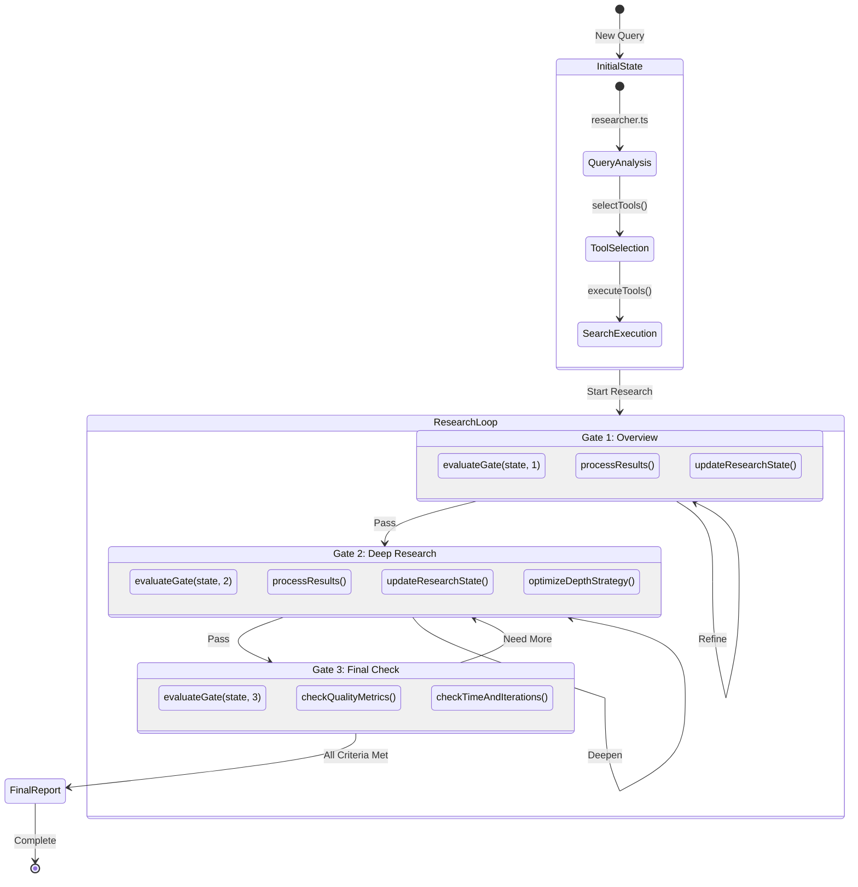
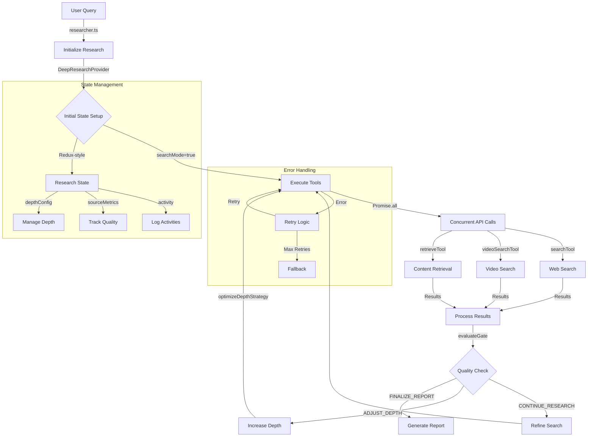

# Deep Research New Flow Proposal

**Brief Thinking Summary (High-Level Reasoning)**  
Our current deep research system already incorporates multi-level depth control, source quality assessment, activity tracking, and a set of specialized tools. To further improve the research agent's autonomy and robustness, we propose a stepwise, iterative enhancement designed around a multi-pass research loop. This loop uses repeated tool calls, iterative query refinement, LLM-driven quality evaluations ("gates"), and adaptive depth and state management to ensure coverage and accuracy. Each phase is implemented, validated, and then extended in a clear sequence.

---

## Overview of the Proposed Approach

These are actionable recommendations to enhance the `@deep-research-provider.tsx` and `@researcher.ts` workflow. They address looping logic, information extraction, quality gating, decision-making on when to stop researching, and overall stability. Implementing these will align the system with best practices for autonomous multi-step research agents.

### 1. Looping and Multi-Stage Research Execution

*   **Refine Search Queries Iteratively:** Implement a loop that allows multiple rounds of tool/API calls. After an initial search, use the findings to tweak subsequent queries (e.g. add new keywords or explore related concepts). This mimics a human researcher's approach of refining queries until the topic is well covered. For example, if results are too broad, the next query can include more specific terms; if too narrow, broaden or use synonyms.
*   **Ensure Comprehensive Coverage:** Don't stop at the first answer. The agent should pivot and try alternative search strategies if initial results are unsatisfactory. Integrate logic to detect when a search produced limited or biased information (e.g. very few results or repeating the same fact) and automatically adjust course. This might mean switching the search engine, using a different API, or querying a subtopic instead of the whole topic.
*   **Stage the Research Process:** Break the research into stages. For instance, Stage 1 can gather general background info, Stage 2 dives into specific subtopics, and so on. In each stage, run a loop of searches and data gathering. Only proceed to the next stage when the current stage's goals are met (e.g. Stage 1 collected all high-level themes). This staged approach ensures the agent first gets a broad view, then drills down systematically.
*   **Progressive Information Extraction:** After each tool call (e.g. a web search or document retrieval), extract the most relevant facts or insights and store them (e.g. in an in-memory list or summary buffer). Use these extracted points to inform the next iteration's queries. For example, if a Wikipedia API call returns several sections of information, parse out key names, dates, or concepts to guide the next search query. This way, each loop builds on the last, gradually painting a fuller picture of the topic.
*   **Query Refinement Strategy:** Implement a strategy for refining queries. If a query returns too many irrelevant results, the next query should be narrower (add context terms). If it returns too few results, make it broader or use alternate phrasing. The code can maintain a history of past queries and their outcome; use this to avoid repeating ineffective searches. For example, if "X research benefits" yielded nothing new, try "advantages of X study" in the next iteration. This feedback loop of query adjustment continues until diminishing returns are observed in new results.

### 2. Extracting Relevant Information and Research Planning

*   **Summarize and Record Key Findings:** After each search or document retrieval, parse and summarize the content for essential points. The system should extract names, dates, statistics, definitions, and other pertinent details from the results. Storing these in a structured format (e.g. a list of bullet points or a brief summary paragraph) will make it easier to see what is known so far. This running summary acts as the agent's "notes" and context for subsequent searches.
*   **Identify Knowledge Gaps:** Use the LLM to analyze the current summary of findings and explicitly ask: "What information is still missing or needs clarification?" This prompt can yield a list of unanswered questions or subtopics. Those become goals for the next research iteration. For instance, if the topic is a historical event and the summary has when and where but not why it happened, the agent should recognize the missing why and plan a search for causes or motivations. This approach ensures each research loop has clear objectives based on what's lacking.
*   **Plan the Next Steps with the LLM:** Leverage the model's reasoning to create a mini research plan at each stage. In code, after summarizing current findings, prompt the LLM (or use a planning function) to suggest the next 2-3 steps. For example: "Given what we know, what should we look up next?" The LLM might respond with something like, "Next, verify statistic X from an official source, and find recent studies about Y." This plan can then be fed into the tool-using loop. The LLM essentially helps chart the path forward, breaking the task into smaller tasks.
*   **Structured Research Workflow:** Establish a formal workflow in the code. One pattern is: (a) High-level overview collection, (b) Deep dives into subtopics, (c) Verification and detail gathering. Each phase can correspond to certain functions or loops in `researcher.ts`. For example, start with a broad search to get an overview (stage a), then for each identified subtopic or question, spawn a focused search loop (stage b). Finally, cross-verify critical facts (stage c) by searching for corroborating sources or using a different tool (like a fact-check API if available). This structured progression makes sure the research is thorough and not missing critical angles.
*   **Dynamic Research Depth:** Allow the system to decide how deep to go into a topic based on its complexity. Simple queries might only need one stage, whereas complex ones spawn multiple sub-research tasks. You could implement a metric (like number of subtopics found, or user's requested depth) to determine if another iteration is warranted. For instance, if the summary still contains statements like "unknown" or "needs more data," that's a signal to continue digging in that area. Conversely, if all sub-questions are answered, it's a signal to wrap up the research.

### 3. Implementing LLM-Based Quality Gating (GATES)

*   **Define Clear Criteria for Each Stage:** For each research stage (or even each iteration), define what "quality" means. For example, after an initial search stage, quality criteria might be "Found information from at least 3 credible sources" and "Identified all major subtopics." Before moving to the next stage, the system should check these criteria. Quality Gates are checkpoints that enforce these requirements. Document these criteria clearly (possibly as code comments or config) so they can be adjusted as needed.
*   **LLM as an Evaluator:** Use an LLM prompt to evaluate whether the criteria are met at a gate. After each stage, feed the LLM a brief summary of findings and a checklist of what should be accomplished in that stage. For example: "Summary: ... Criteria: (1) at least 3 sources, (2) identified subtopics A, B, C, (3) no major contradictions. Did we meet these?" The LLM can respond with an assessment. If the assessment is negative or uncertain, the agent should loop back for more research before passing through the gate. Essentially, the LLM acts as a quality inspector gating the process.
*   **Automated Feedback for Improvement:** When a gate is not passed, the system should not just blindly loop; it should improve. Take the LLM's evaluation and extract actionable feedback. For instance, if the LLM says "Criterion 2 not met: subtopic C is missing details," the system can target that specifically in the next iteration (e.g. search for "Subtopic C detailed analysis"). This implements a self-correcting loop where the agent fixes gaps before proceeding.
*   **Multi-Stage Evaluation:** Different gates for different stages:
    *   Gate 1 (Post-Overview): Did we gather a broad understanding? Are the main aspects of the question identified?
    *   Gate 2 (Post-Deep Research): Are all sub-questions answered with evidence? Is the information cross-verified?
    *   Gate 3 (Pre-Final Report): Is the final draft well-structured, factual, and comprehensive?

    Use the LLM to rate or give a pass/fail on each. Only move forward if the gate passes. This staged evaluation prevents early finalization when there are still gaps, and it ensures each phase output is up to par before the next begins.
*   **Inline Critique and Self-Refinement:** Encourage the LLM to critique its own outputs at smaller granularity as well. For instance, after composing a summary of a source, have a quick check: "Is this summary accurate and relevant?" The LLM can generate a brief self-feedback and if it spots an issue (perhaps hallucinated a detail or included extraneous info), it can correct it immediately. This principle of self-refinement can greatly improve quality by catching errors early. Integrating such checks into the code (possibly as a function call like `evaluate_output(summary)`) will act as mini-gates throughout the process.

### 4. Decision-Making Between Report Generation and Further Research

*   **Set Termination Conditions:** The system needs a clear decision policy on when to stop researching and start compiling the report.

    *   **LLM-based Evaluator:** Use an LLM-based evaluator after each major loop to ask: "Is the research sufficient to answer the question thoroughly?" If yes (or quality gates are satisfied), proceed to report generation. If no, and limits haven't been hit, continue researching. (LESSWRONG.COM)

*   **Iteration Limits and Time Budget:** Enforce an upper bound on research duration or iterations to avoid endless loops.

    *   **Limit:** Limit to N iterations or ~X minutes (e.g., 5-10 minutes additional if needed).
    *   **Awareness:** The agent should be aware of this budget.
    *   **Strategy:** Track elapsed time/iterations and attempt to wrap up as the limit nears. Perform a final broad search to catch any last info, then finalize. (MEDIUM.COM)

*   **Diminishing Returns Check:** Implement a check for diminishing returns to decide on stopping.

    *   **Signal:** If the last one or two research iterations produced little new information (e.g., summaries repeating facts), that's a strong signal.
    *   **Detection:** Detect this by comparing newly extracted info with the existing knowledge base.
    *   **Action:** If similarity is high or no new points were added, move to reporting.

*   **Final Gate – Ready to Report?:** Before generating the final report, have a final gate that definitively assesses if the answer is complete.

    *   **LLM Evaluator Question:** Ask the LLM evaluator: "Have we answered the original query fully? Are all aspects covered with evidence? If yes, output READY TO REPORT. If no, list what's missing."
    *   **Action:** If it outputs "READY TO REPORT," the loop can break. If it lists missing items and the iteration limit isn't reached, the agent should go back and try to gather that remaining info. (LESSWRONG.COM)

*   **User Override and Guidance:** Optionally, integrate a mechanism for user confirmation.

    *   **Prompt:** If unsure whether to continue, present a brief summary of progress and ask the user "Should I dig deeper or is this sufficient?"
    *   **Note:** Rely on automated checks if a fully autonomous system is the goal.

### 5. Ensuring Stability and Efficiency

*   **Robust Error Handling:** Wrap external API calls (search queries, webpage fetches, etc.) in try/catch (or equivalent) blocks.

    *   **Handling Failure:** If a call fails, handle it gracefully: log the error, wait/retry if appropriate, or try an alternative strategy.
    *   **Example:** If the primary search API fails, switch to a backup API or a cached result.
    *   **Malformed Output:** Detect and handle when the LLM's tool output is malformed or incomplete (e.g., if it returns an invalid URL). (RUNLOOP.AI)

*   **Prevent Redundant Calls:** Implement checks to avoid duplicating work.

    *   **Cache:** Keep a cache or set of all search queries already attempted and the URLs already fetched.
    *   **Comparison:** Before issuing a new query, compare it against past queries (perhaps using a simple string similarity or exact match).
    *   **Action:** Skip or modify it if it's too similar to something tried before. If the LLM suggests visiting a URL that was already processed, skip it or remind the model that the content is known.

*   **Detect and Break Out of Stuck Loops:** Program a safeguard counter.

    *   **Counter:** If the same action has been repeated X times with no new info, intervene.
    *   **Intervention:** Force a new approach (e.g., inject a new prompt to the LLM like "Try a different approach to find new information") or terminate the loop with a fallback response.
    *   **Monitoring:** Monitoring loop iterations and variance in results can catch this scenario early.

*   **Concurrency for Efficiency:** Take advantage of parallel operations where possible.

    *   **Example:** If in one iteration the LLM identifies three different web pages to read, fetch all three concurrently rather than sequentially.
    *   **Implementation:** Use Promise.all in Node.js for multiple fetches.
    *   **Frameworks:** Some frameworks (like LangChain's tools) even support invoking multiple tools in parallel within one agent step. (PYTHON.LANGCHAIN.COM, MEDIUM.COM)
    *   **Caution:** Ensure thread-safety or request limits are respected (don't overload a single API with too many simultaneous requests), but utilize concurrency to reduce idle waiting time.

*   **Optimize LLM Calls and Token Usage:** Reuse context where appropriate instead of prompting from scratch each time.

    *   **Running Summary:** Maintain a running summary that gets updated, so the LLM doesn't need to read all prior content every loop.
    *   **Model Cascading:** Consider using smaller/cheaper models for routine tasks like intermediate summaries or formatting, reserving the large model for the complex reasoning or final synthesis.

*   **Thorough Testing and Logging:** Ensure you have good logging around the research loop.

    *   **Logs:** Log each query made, each decision at a gate, and any errors or retries.
    *   **Purpose:** This will help in debugging if the loop behaves unexpectedly.
    *   **Fine-tuning:** Fine-tune the loop parameters (like iteration limits, timeouts, similarity thresholds for duplicate checks) to achieve a stable and efficient research cycle.
    *   **Analysis:** Analyze these logs to find bottlenecks – for example, if a certain stage always takes the longest, you might optimize that stage's logic or make it concurrent.

---
### Flow Chart of the Proposed Approach







### Key Implementation Components

1. **Researcher.ts Core Functions**
```typescript
// Main research function that initializes the research process
export function researcher({
  messages,      // Chat history and context
  model,         // LLM model to use (e.g. GPT-4)
  searchMode     // Whether to enable multi-step research mode
}: ResearcherConfig): ResearcherReturn {
  return {
    // Initialize the specified LLM model
    model: getModel(model),
    
    // Set up system prompt that guides the LLM's behavior
    system: SYSTEM_PROMPT,
    
    // Pass through chat history
    messages,
    
    // Available research tools (search, video, retrieve)
    tools: AVAILABLE_TOOLS,
    
    // Only activate tools if in search mode
    experimental_activeTools: searchMode ? Object.keys(AVAILABLE_TOOLS) : [],
    
    // Allow more steps in search mode for iterative research
    maxSteps: searchMode ? 5 : 1,
    
    // Configure streaming with word-level chunking for smooth output
    experimental_transform: smoothStream({ chunking: 'word' })
  }
}

// Evaluates research progress at specific checkpoints (gates)
async function evaluateGate(
  state: DeepResearchState,    // Current research state
  gateNumber: number           // Which gate (1-3) to evaluate
): Promise<GateDecision> {
  // Implementation details...
  // Uses LLM to assess if current research meets quality criteria
  // Returns decision to continue, adjust depth, or finalize
}
```

2. **DeepResearchProvider Actions**
```typescript
// Define all possible actions that can modify research state
type DeepResearchAction =
  // Trigger quality evaluation at a specific gate
  | { type: 'EVALUATE_GATE'; payload: { gateNumber: number } }
  
  // Continue research with current parameters
  | { type: 'CONTINUE_RESEARCH' }
  
  // Modify research depth based on findings
  | { type: 'ADJUST_DEPTH'; payload: { newDepth: number } }
  
  // Complete research and generate final report
  | { type: 'FINALIZE_REPORT' }
  // ... other actions
```

3. **Tool Execution**
```typescript
// Executes multiple research tools concurrently with rate limiting
async function executeTools(
  tools: Tool[],              // Array of research tools to use
  query: string,              // Search query or research question
  concurrencyLimit: number    // Max number of concurrent API calls
): Promise<ToolResults> {
  // Create rate limiter to prevent API overload
  const limit = pLimit(concurrencyLimit)
  
  // Map each tool to a rate-limited promise
  const promises = tools.map(tool => 
    limit(() => tool.execute({ query }))
  )
  
  // Execute all tool calls concurrently
  return Promise.all(promises)
}
```

4. **Quality Gates**
```typescript
// Define the structure for research quality evaluation gates
const researchGates: QualityGate[] = [
  {
    gateNumber: 1,
    name: 'Initial Overview',
    // Define minimum criteria for passing initial research phase
    criteria: {
      minSources: 3,                    // Must have at least 3 distinct sources
      minRelevanceScore: 0.6,           // Sources must be at least 60% relevant
      requiredCoverage: [               // Must cover these basic topics
        'overview',                     // General topic overview
        'main_topics'                   // Key subtopics identified
      ]
    },
    // Evaluator function checks if overview phase is complete
    evaluator: async (state: EnhancedResearchState) => {
      // Evaluate the completeness of the overview
      const evaluation = await evaluateOverview(state)
      
      // Calculate final score and make decision
      const overviewScore = evaluation.score
      const hasRequiredCoverage = checkTopicCoverage(
        state.sources,
        criteria.requiredCoverage
      )
      
      return {
        passed: overviewScore >= 0.8,    // 80% threshold for overview quality
        score: overviewScore,
        feedback: generateFeedback(evaluation), // Generate detailed feedback
        // Decide next action based on score and coverage
        decision: (overviewScore >= 0.8 && hasRequiredCoverage) 
          ? 'PROCEED_TO_DEEP_RESEARCH'   // Move to next phase if criteria met
          : 'CONTINUE_OVERVIEW'          // Otherwise continue gathering overview
      }
    }
  },
  {
    gateNumber: 2,
    name: 'Deep Research',
    // Criteria for deep research phase
    criteria: {
      minSourcesPerTopic: 2,            // Each subtopic needs 2+ sources
      crossValidation: true,            // Facts must be cross-validated
      depthScore: 0.7                   // Higher threshold for depth
    },
    // Evaluator for deep research phase
    evaluator: async (state: EnhancedResearchState) => {
      // Check depth and coverage of research
      const evaluation = await evaluateDepth(state)
      
      // Analyze cross-validation of facts
      const crossValidated = await checkCrossValidation(state.sources)
      
      // Check coverage per subtopic
      const topicCoverage = await analyzeTopicCoverage(
        state.sources,
        state.researchProgress.remainingQuestions
      )
      
      return {
        passed: evaluation.score >= 0.7,  // 70% threshold for depth
        score: evaluation.score,
        feedback: generateDetailedFeedback({
          evaluation,
          crossValidated,
          topicCoverage
        }),
        // Decide whether to continue research or prepare report
        decision: shouldContinueResearch(evaluation, crossValidated, topicCoverage)
          ? 'CONTINUE_RESEARCH'
          : 'PREPARE_REPORT'
      }
    }
  }
]

// Helper function to check topic coverage in sources
function checkTopicCoverage(
  sources: ResearchSource[],
  requiredTopics: string[]
): boolean {
  // Map each source to its covered topics
  const coveredTopics = new Set(
    sources.flatMap(source => 
      extractTopics(source.content)
    )
  )
  
  // Check if all required topics are covered
  return requiredTopics.every(topic =>
    coveredTopics.has(topic)
  )
}

// Helper to generate detailed feedback for gate evaluation
function generateDetailedFeedback({
  evaluation,
  crossValidated,
  topicCoverage
}: EvaluationResults): string {
  let feedback = []
  
  // Add score-based feedback
  feedback.push(`Overall quality score: ${evaluation.score}`)
  
  // Add cross-validation status
  if (!crossValidated) {
    feedback.push('Some facts need additional verification')
  }
  
  // Add topic coverage feedback
  const missingTopics = findMissingTopics(topicCoverage)
  if (missingTopics.length > 0) {
    feedback.push(`Missing coverage for: ${missingTopics.join(', ')}`)
  }
  
  return feedback.join('\n')
}

// Decision helper for continuing research
function shouldContinueResearch(
  evaluation: Evaluation,
  crossValidated: boolean,
  topicCoverage: TopicCoverage
): boolean {
  // Continue if any of these conditions are true
  return (
    evaluation.score < 0.7 ||           // Score below threshold
    !crossValidated ||                  // Facts need verification
    hasMissingTopics(topicCoverage) ||  // Topics not fully covered
    evaluation.hasUnansweredQuestions   // Questions remain
  )
}
```

5. **Research Controller Helper Functions**
```typescript
// Helper functions for the Research Controller class
class ResearchControllerHelpers {
  // Calculates how much new information was gained
  private calculateNewInformationScore(
    previousFindings: ResearchFindings,
    newResults: ToolResults
  ): number {
    // Extract key points from previous findings
    const existingPoints = new Set(
      previousFindings.flatMap(f => extractKeyPoints(f))
    )
    
    // Extract key points from new results
    const newPoints = extractKeyPoints(newResults)
    
    // Calculate how many new points were found
    const novelPoints = newPoints.filter(point => 
      !existingPoints.has(point)
    )
    
    // Return score based on ratio of new to total points
    return novelPoints.length / newPoints.length
  }
  
  // Updates the trend of information gain over time
  private updateInformationGainTrend(
    newScore: number
  ): void {
    // Add new score to rolling average
    this.infoGainHistory.push({
      score: newScore,
      timestamp: Date.now()
    })
    
    // Keep only recent history (last 5 iterations)
    if (this.infoGainHistory.length > 5) {
      this.infoGainHistory.shift()
    }
    
    // Calculate trend
    this.currentTrend = calculateTrend(this.infoGainHistory)
  }
  
  // Checks if depth strategy should be optimized
  private shouldOptimizeDepth(
    metrics: SourceMetrics
  ): boolean {
    // Check if current depth is yielding good results
    const isEffectiveDepth = metrics.relevanceScore > 0.7
    
    // Check if we're finding new information
    const diminishingReturns = this.checkForDiminishingReturns()
    
    // Check if we have budget for deeper search
    const hasDepthBudget = this.state.currentDepth < this.state.maxDepth
    
    return !isEffectiveDepth && !diminishingReturns && hasDepthBudget
  }
  
  // Optimizes the depth strategy based on results
  private async optimizeDepthStrategy(): Promise<void> {
    // Calculate optimal depth based on current metrics
    const optimalDepth = await this.calculateOptimalDepth(
      this.state.sourceMetrics,
      this.state.currentDepth
    )
    
    // Update depth if different from current
    if (optimalDepth !== this.state.currentDepth) {
      await this.updateDepth(optimalDepth)
    }
  }
}
```

These improvements provide a more robust and maintainable research system with:
- Clear state management
- Structured gate evaluation
- Comprehensive error handling
- Efficient tool execution
- Progress tracking and reporting

The implementation details align with our mermaid diagrams and existing codebase while adding the new functionality in a way that maintains compatibility with our current systems.

---

## Proposed Improvements (with Implementation Details)

1. **Enhanced Research State Management**
   * **Current Implementation**:
   ```typescript
   // Core research state interface defining the current system's capabilities
   interface DeepResearchState {
     isActive: boolean                    // Whether research is currently running
     activity: ResearchActivity[]         // Log of all research actions taken
     sources: ResearchSource[]            // Collection of found sources
     currentDepth: number                 // Current research depth level
     maxDepth: number                     // Maximum allowed depth
     completedSteps: number              // Number of completed research steps
     totalExpectedSteps: number          // Expected total steps for progress calc
     depthConfig: ResearchDepthConfig    // Configuration for depth management
     sourceMetrics: ResearchSourceMetrics[] // Quality metrics for sources
     suggestions: ResearchSuggestion[]    // AI-generated research suggestions
     researchMemory: ResearchMemory[]     // Persistent research context
   }
   ```
   * **Proposed Enhancement**:
   ```typescript
   // Enhanced state interface with additional tracking capabilities
   interface EnhancedResearchState extends DeepResearchState {
     // Track status and results of quality gates
     gateStatus: {
       currentGate: number           // Current active gate (1-3)
       gateResults: {
         [key: number]: {           // Results indexed by gate number
           passed: boolean          // Whether gate criteria were met
           score: number           // Numerical quality score (0-1)
           feedback: string        // Detailed feedback from evaluation
           timestamp: number       // When evaluation occurred
         }
       }
     }
     
     // Metrics for monitoring research progress
     iterationMetrics: {
       startTime: number                    // When research began
       repetitionCount: number              // Number of research iterations
       toolCallCounts: Record<string, number> // Usage count per tool
       failedAttempts: Record<string, number> // Failed attempts per tool
     }
     
     // Detailed progress tracking
     researchProgress: {
       currentStage: 'overview' | 'deep_research' | 'verification' | 'report'
       stageProgress: number                // Progress within current stage (0-1)
       remainingQuestions: string[]         // Questions yet to be answered
     }
   }
   ```

2. **Researcher.ts Integration**
   * **Current Implementation**:
   ```typescript
   export function researcher({
     messages,
     model,
     searchMode
   }: ResearcherConfig): ResearcherReturn {
     return {
       model: getModel(model),
       system: SYSTEM_PROMPT,
       messages,
       tools: AVAILABLE_TOOLS,
       experimental_activeTools: searchMode ? Object.keys(AVAILABLE_TOOLS) : [],
       maxSteps: searchMode ? 5 : 1,
       experimental_transform: smoothStream({ chunking: 'word' })
     }
   }
   ```
   * **Enhanced Version**:
   ```typescript
   export function enhancedResearcher({
     messages,
     model,
     searchMode,
     researchConfig
   }: EnhancedResearcherConfig): ResearcherReturn {
     const researchController = new ResearchController({
       gates: researchGates,
       tools: AVAILABLE_TOOLS,
       maxIterations: researchConfig.maxIterations || 10,
       timeLimit: researchConfig.timeLimit || 600000, // 10 minutes
       concurrencyLimit: researchConfig.concurrencyLimit || 3
     })

     return {
       model: getModel(model),
       system: ENHANCED_SYSTEM_PROMPT,
       messages,
       tools: AVAILABLE_TOOLS,
       experimental_activeTools: searchMode ? 
         researchController.getActiveTools() : [],
       maxSteps: researchConfig.maxSteps || 15,
       experimental_transform: enhancedStreamTransform({
         chunking: 'word',
         progressCallback: researchController.updateProgress
       }),
       onToolCall: researchController.handleToolCall,
       onGateEvaluation: researchController.evaluateGate
     }
   }
   ```

3. **Research Controller Implementation**
   ```typescript
   // Main controller class managing the research process
   class ResearchController {
     // Core configuration and state
     private gates: QualityGate[]          // Available quality gates
     private tools: Tool[]                 // Available research tools
     private state: EnhancedResearchState  // Current research state
     
     // Handles execution of research tools with error handling
     async handleToolCall(tool: Tool, args: any): Promise<ToolResults> {
       // Create rate limiter for concurrent calls
       const limit = pLimit(this.config.concurrencyLimit)
       
       try {
         // Execute tool with retry logic and rate limiting
         const result = await limit(() => this.executeWithRetry(tool, args))
         
         // Process and store results
         await this.processToolResult(result)
         return result
       } catch (error) {
         // Handle any errors during tool execution
         this.handleToolError(error, tool)
         throw error
       }
     }

     // Evaluates research quality at specific gates
     async evaluateGate(gateNumber: number): Promise<GateDecision> {
       // Get the appropriate gate configuration
       const gate = this.gates[gateNumber - 1]
       
       // Evaluate current state against gate criteria
       const evaluation = await gate.evaluator(this.state)
       
       // Store evaluation results in state
       this.state.gateStatus.gateResults[gateNumber] = {
         passed: evaluation.passed,      // Whether criteria were met
         score: evaluation.score,        // Quality score
         feedback: evaluation.feedback,  // Detailed feedback
         timestamp: Date.now()          // When evaluation occurred
       }

       return evaluation.decision
     }

     // Processes results from tool execution
     private async processToolResult(result: ToolResults): Promise<void> {
       // Update metrics, extract information, etc.
       await this.updateSourceMetrics(result)
       await this.extractAndStoreInsights(result)
       this.checkForDiminishingReturns()
     }
     
     // Checks if research is yielding new information
     private checkForDiminishingReturns(): boolean {
       // Compare new findings against existing knowledge
       const newInfoScore = this.calculateNewInformationScore()
       
       // Track trend of information gain
       this.updateInformationGainTrend(newInfoScore)
       
       // Return true if returns are diminishing
       return newInfoScore < this.config.diminishingReturnsThreshold
     }
     
     // Updates metrics for source quality
     private async updateSourceMetrics(result: ToolResults): Promise<void> {
       // Calculate relevance and quality scores
       const metrics = await this.calculateSourceMetrics(result)
       
       // Update state with new metrics
       this.state.sourceMetrics.push(metrics)
       
       // Trigger depth strategy optimization if needed
       if (this.shouldOptimizeDepth(metrics)) {
         await this.optimizeDepthStrategy()
       }
     }
   }
   ```

4. **Quality Gates Implementation**
```typescript
// Define the structure for research quality evaluation gates
const researchGates: QualityGate[] = [
  {
    gateNumber: 1,
    name: 'Initial Overview',
    // Define minimum criteria for passing initial research phase
    criteria: {
      minSources: 3,                    // Must have at least 3 distinct sources
      minRelevanceScore: 0.6,           // Sources must be at least 60% relevant
      requiredCoverage: [               // Must cover these basic topics
        'overview',                     // General topic overview
        'main_topics'                   // Key subtopics identified
      ]
    },
    // Evaluator function checks if overview phase is complete
    evaluator: async (state: EnhancedResearchState) => {
      // Evaluate the completeness of the overview
      const evaluation = await evaluateOverview(state)
      
      // Calculate final score and make decision
      const overviewScore = evaluation.score
      const hasRequiredCoverage = checkTopicCoverage(
        state.sources,
        criteria.requiredCoverage
      )
      
      return {
        passed: overviewScore >= 0.8,    // 80% threshold for overview quality
        score: overviewScore,
        feedback: generateFeedback(evaluation), // Generate detailed feedback
        // Decide next action based on score and coverage
        decision: (overviewScore >= 0.8 && hasRequiredCoverage) 
          ? 'PROCEED_TO_DEEP_RESEARCH'   // Move to next phase if criteria met
          : 'CONTINUE_OVERVIEW'          // Otherwise continue gathering overview
      }
    }
  },
  {
    gateNumber: 2,
    name: 'Deep Research',
    // Criteria for deep research phase
    criteria: {
      minSourcesPerTopic: 2,            // Each subtopic needs 2+ sources
      crossValidation: true,            // Facts must be cross-validated
      depthScore: 0.7                   // Higher threshold for depth
    },
    // Evaluator for deep research phase
    evaluator: async (state: EnhancedResearchState) => {
      // Check depth and coverage of research
      const evaluation = await evaluateDepth(state)
      
      // Analyze cross-validation of facts
      const crossValidated = await checkCrossValidation(state.sources)
      
      // Check coverage per subtopic
      const topicCoverage = await analyzeTopicCoverage(
        state.sources,
        state.researchProgress.remainingQuestions
      )
      
      return {
        passed: evaluation.score >= 0.7,  // 70% threshold for depth
        score: evaluation.score,
        feedback: generateDetailedFeedback({
          evaluation,
          crossValidated,
          topicCoverage
        }),
        // Decide whether to continue research or prepare report
        decision: shouldContinueResearch(evaluation, crossValidated, topicCoverage)
          ? 'CONTINUE_RESEARCH'
          : 'PREPARE_REPORT'
      }
    }
  }
]

// Helper function to check topic coverage in sources
function checkTopicCoverage(
  sources: ResearchSource[],
  requiredTopics: string[]
): boolean {
  // Map each source to its covered topics
  const coveredTopics = new Set(
    sources.flatMap(source => 
      extractTopics(source.content)
    )
  )
  
  // Check if all required topics are covered
  return requiredTopics.every(topic =>
    coveredTopics.has(topic)
  )
}

// Helper to generate detailed feedback for gate evaluation
function generateDetailedFeedback({
  evaluation,
  crossValidated,
  topicCoverage
}: EvaluationResults): string {
  let feedback = []
  
  // Add score-based feedback
  feedback.push(`Overall quality score: ${evaluation.score}`)
  
  // Add cross-validation status
  if (!crossValidated) {
    feedback.push('Some facts need additional verification')
  }
  
  // Add topic coverage feedback
  const missingTopics = findMissingTopics(topicCoverage)
  if (missingTopics.length > 0) {
    feedback.push(`Missing coverage for: ${missingTopics.join(', ')}`)
  }
  
  return feedback.join('\n')
}

// Decision helper for continuing research
function shouldContinueResearch(
  evaluation: Evaluation,
  crossValidated: boolean,
  topicCoverage: TopicCoverage
): boolean {
  // Continue if any of these conditions are true
  return (
    evaluation.score < 0.7 ||           // Score below threshold
    !crossValidated ||                  // Facts need verification
    hasMissingTopics(topicCoverage) ||  // Topics not fully covered
    evaluation.hasUnansweredQuestions   // Questions remain
  )
}
```

5. **Research Controller Helper Functions**
```typescript
// Helper functions for the Research Controller class
class ResearchControllerHelpers {
  // Calculates how much new information was gained
  private calculateNewInformationScore(
    previousFindings: ResearchFindings,
    newResults: ToolResults
  ): number {
    // Extract key points from previous findings
    const existingPoints = new Set(
      previousFindings.flatMap(f => extractKeyPoints(f))
    )
    
    // Extract key points from new results
    const newPoints = extractKeyPoints(newResults)
    
    // Calculate how many new points were found
    const novelPoints = newPoints.filter(point => 
      !existingPoints.has(point)
    )
    
    // Return score based on ratio of new to total points
    return novelPoints.length / newPoints.length
  }
  
  // Updates the trend of information gain over time
  private updateInformationGainTrend(
    newScore: number
  ): void {
    // Add new score to rolling average
    this.infoGainHistory.push({
      score: newScore,
      timestamp: Date.now()
    })
    
    // Keep only recent history (last 5 iterations)
    if (this.infoGainHistory.length > 5) {
      this.infoGainHistory.shift()
    }
    
    // Calculate trend
    this.currentTrend = calculateTrend(this.infoGainHistory)
  }
  
  // Checks if depth strategy should be optimized
  private shouldOptimizeDepth(
    metrics: SourceMetrics
  ): boolean {
    // Check if current depth is yielding good results
    const isEffectiveDepth = metrics.relevanceScore > 0.7
    
    // Check if we're finding new information
    const diminishingReturns = this.checkForDiminishingReturns()
    
    // Check if we have budget for deeper search
    const hasDepthBudget = this.state.currentDepth < this.state.maxDepth
    
    return !isEffectiveDepth && !diminishingReturns && hasDepthBudget
  }
  
  // Optimizes the depth strategy based on results
  private async optimizeDepthStrategy(): Promise<void> {
    // Calculate optimal depth based on current metrics
    const optimalDepth = await this.calculateOptimalDepth(
      this.state.sourceMetrics,
      this.state.currentDepth
    )
    
    // Update depth if different from current
    if (optimalDepth !== this.state.currentDepth) {
      await this.updateDepth(optimalDepth)
    }
  }
}
```

These improvements provide a more robust and maintainable research system with:
- Clear state management
- Structured gate evaluation
- Comprehensive error handling
- Efficient tool execution
- Progress tracking and reporting

The implementation details align with our mermaid diagrams and existing codebase while adding the new functionality in a way that maintains compatibility with our current systems.

---

## Conclusion

By incorporating a multi-stage gating mechanism, repeated searches, adaptive depth changes used in synergy with concurrency, and structured final outputs, we can bring our deep research flow closer to the iterative design outlined in the reference document. These changes improve reliability, maintainability, and clarity in the codebase. The added implementation details provide a clearer roadmap for implementing these changes in the code.
